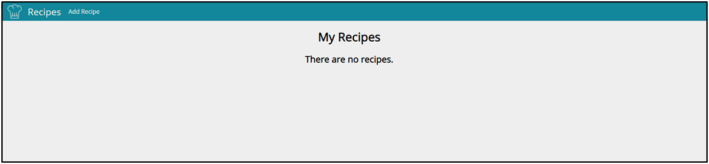
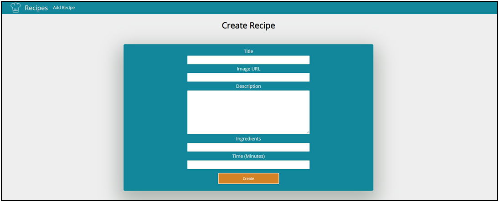
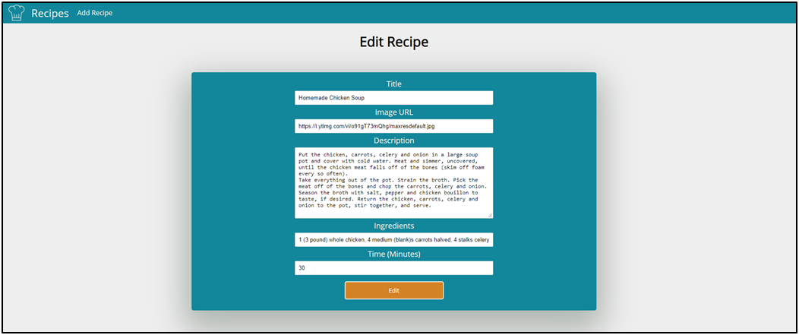
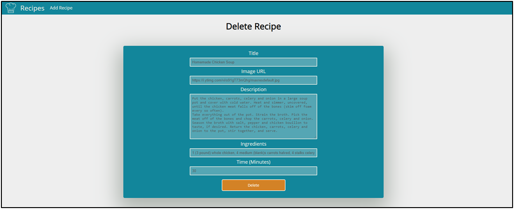
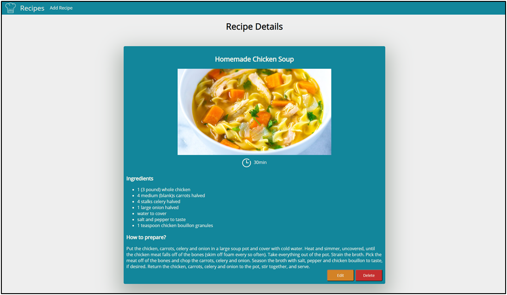

                     Python Web Basics Exam – Recipes

Recipes is an application where you can add, edit and delete your own recipes. You can also open a details page of each recipe to see the time needed for the recipe, the ingredients and the full description.
1.	Skeleton
You are provided with all the html pages, all the images and the CSS for the project.
2.	Database
You will need 1 model:
•	Recipe
o	title - Character field with max length of 30 characters
o	image_url - URL field
o	description - Text field
o	ingredients - Character field with max length of 250 characters
o	time - Integer field
3.	Routes
•	'/' - home page
•	'/create' - create recipe page
•	'/edit/:id' - edit recipe page
•	'/delete/:id' - delete recipe page
•	'/details/:id' - recipe details page
4.	Pages
Home Page – 30p  !
If there are no recipes created yet:

If there are recipes:

Create Recipe Page – 20p
The ingredients should be separated by ", ". After the button is clicked, create the recipe and redirect to home.

Edit Recipe Page – 15p
The form must be filled with the data of the recipe we want to edit. When the button is clicked, edit the recipe and redirect to home.

Delete Recipe Page – 15p
The form must be filled with the data of the recipe and the fields should be disabled. When the button is clicked, delete the recipe and redirect to home.

Recipe Details Page – 20p
Fill the needed data. The ingredients should be separate "li" items.

