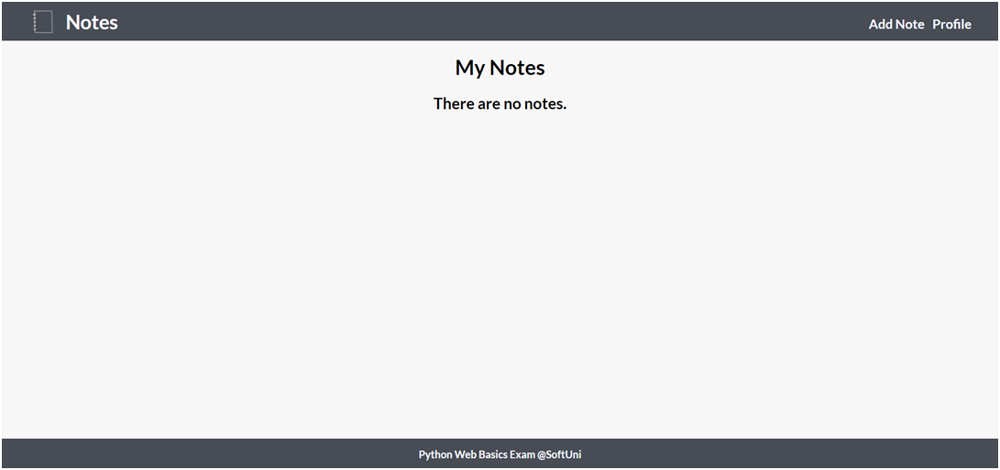
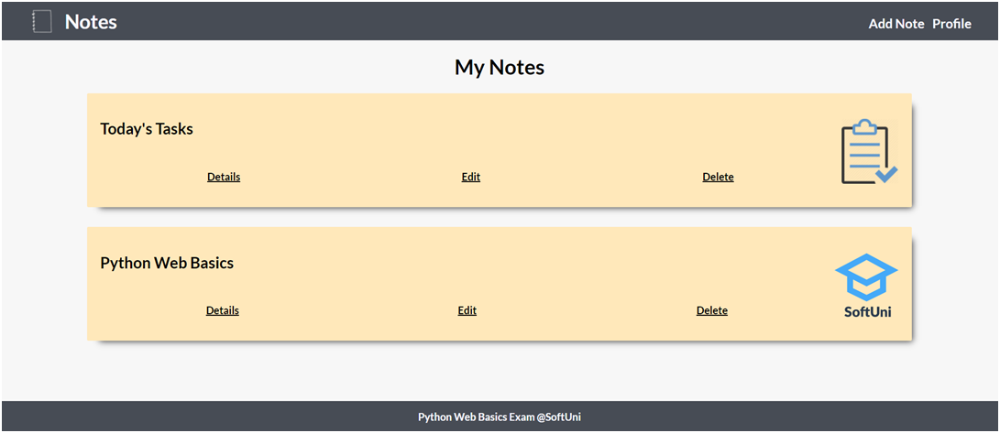
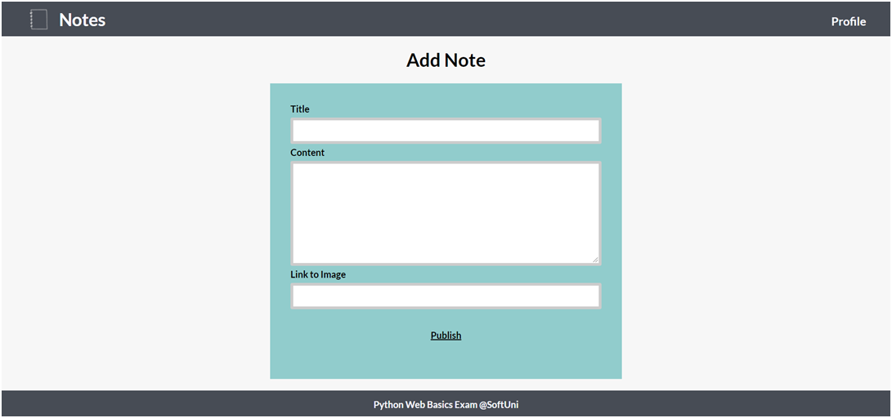
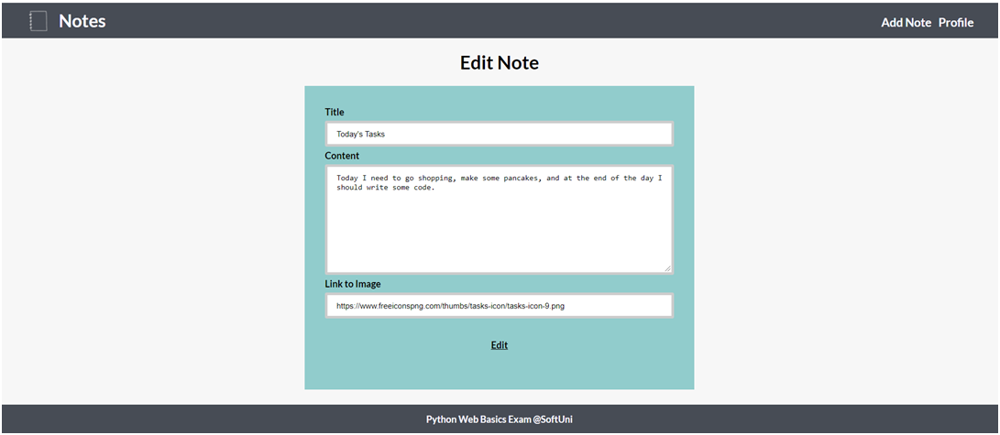
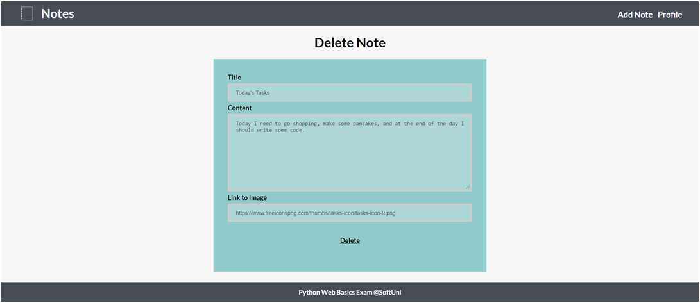
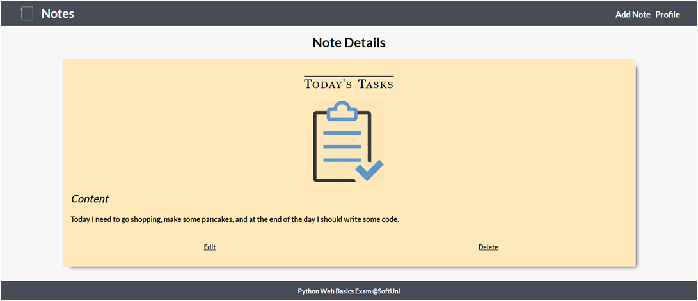
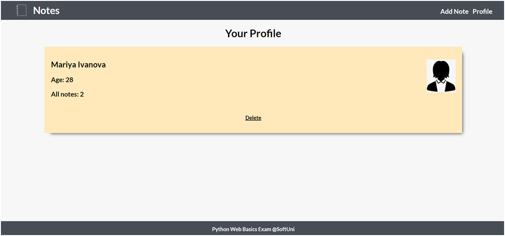

              Python Web Basics Exam – Notes

Notes is an application where we create our own profiles and manage our notes. We can open a details page of each note to see the full content.
1.	Skeleton
You are provided with all the html pages, all the images and the CSS for the project.

2.	Database
You will need 2 models:
•	Profile
o	first_name - Character field with max length of 20 characters
o	last_name - Character field with max length of 20 characters
o	age - Integer field
o	image_url - URL field
•	Note
o	title - Character field with max length of 30 characters
o	image_url - URL field
o	content - Text field

3.	Routes
•	http://localhost:8000/ - home page
•	http://localhost:8000/add - add note page
•	http://localhost:8000/edit/:id - edit note page
•	http://localhost:8000/delete/:id - delete note page
•	http://localhost:8000/details/:id - note details page
•	http://localhost:8000/profile - profile page

4.	Pages
Home Page – 20p
If there is no profile created yet:

If a profile has been created and there are no notes:

There is a profile and notes:

Add Note Page – 15p
After the button "Publish" is clicked, add the note and redirect to home:

Edit Note Page – 15p
The form must be filled with the data of the note we want to edit. When the button "Edit" is clicked, edit the note and redirect to home.

Delete Note Page – 15p
The form must be filled with the data of the note and the fields should be disabled. When the button "Delete" is clicked, delete the note and redirect to home.

Note Details Page – 20p
Fill the needed data: title, image, and content. Also, the view should have two buttons at the bottom – "Edit" and "Delete".

Profile Page - 15
The number of notes you have at the current moment should be displayed on the profile page. When the button "Delete" is clicked, delete the profile and all notes, then redirect to home page with no profile:

