                              Car Collection App - Python Web Basics Exam

The app allows the user to browse different cars, including their price, category, year, type, and model. The user can create, edit, or delete cars at any time. He/ She can also edit or delete his/ her profile.
1. Skeleton
You are provided with all the needed HTML pages, images, and CSS for the project.
2. Database
You will need 2 models:
•	Profile
o	Username
	Character field, required.
	It should consist of a maximum of 10 characters.
	It should consist of a minimum of 2 characters. Otherwise, raise a ValidationError with the message: "The username must be a minimum of 2 chars" 
o	Email
	Email field, required.
o	Age
	Integer field, required.
	The age cannot be below 18.
o	Password
	Character (password) field, required.
	It should consist of a maximum of 30 characters.
o	First Name
	Character field, optional.
	It should consist of a maximum of 30 characters.
o	Last Name
	Character field, optional.
	It should consist of a maximum of 30 characters.
o	Profile Picture
	URL field, optional.
•	Car
o	Type
	Character (choice) field, required.
	It should consist of a maximum of 10 characters.
	The choices are "Sports Car", "Pickup", "Crossover", "Minibus" and "Other".
o	Model
	Character field, required.
	It should consist of a maximum of 20 characters.
	It should consist of a minimum of 2 characters.
o	Year
	Integer field, required.
	Valid year is a year between 1980 and 2049 (both inclusive). Otherwise, raise a ValidationError with the message: "Year must be between 1980 and 2049"
o	Image Url
	URL field, required.
o	Price
	Float field, required.
	Price cannot be below 1.	
Note: the validations will be examined only by the user side, not the admin side.
3. Routes
•	http://localhost:8000/ - index page
•	http://localhost:8000/profile/create - profile create page
•	http://localhost:8000/catalogue/ - catalogue page
•	http://localhost:8000/car/create/ - car create page
•	http://localhost:8000/car/<car-id>/details/ - car details page
•	http://localhost:8000/car/<car-id>/edit/ - car edit page
•	http://localhost:8000/car/<car-id>/delete/ - car delete page
•	http://localhost:8000/profile/details/ - profile details page
•	http://localhost:8000/profile/edit/ - profile edit page
•	http://localhost:8000/profile/delete/ - profile delete page
4. Pages
Index Page 
Template file: "index.html"
The page consists of:
•	A navigation bar with:
o	"Cars Collection" link, which leads to the index page.
o	"Create Profile" link, which leads to create profile page.
o	"Catalogue" link, which leads to the catalogue page.
o	"Create Car" link, which leads to the create car page.
o	"Profile" link, which leads to the profile details page.
•	"Our cars collections is expecting you!" headline and a default image.
The "Create Profile" link on the navigation bar is only visible when the user has NOT created a profile yet:

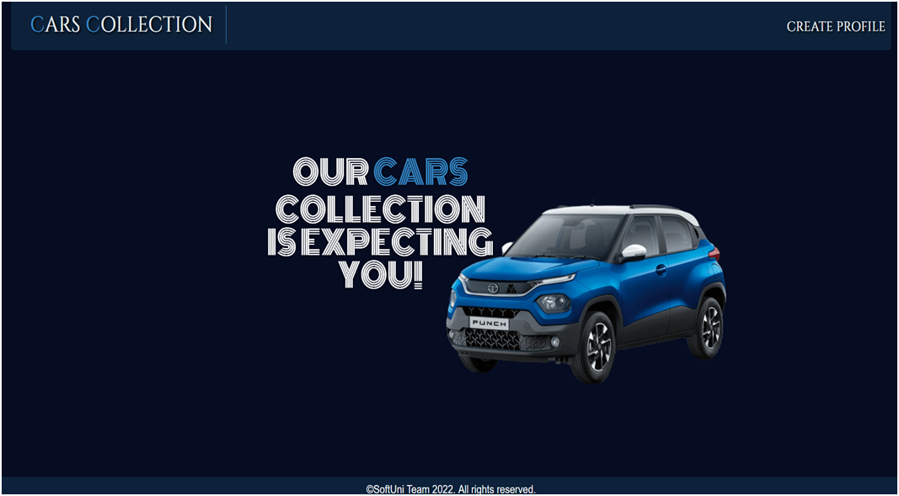

The "Catalogue", "Create Car", and "Profile" links on the navigation bar are only visible when the user has a profile:

Profile Create Page 
Template file: "create-profile.html"
The page consists of:
•	A navigation bar with:
o	"Cars Collection" link, which leads to the index page.
o	"Create Profile" link, which leads to create profile page.
•	A profile creation form consisting of:
o	An "Username:" field
o	An "Email:" field
o	An "Age:" field
o	A "Password:" field. In the form, the characters must be hidden.
•	A button "Create Profile"
o	When you click on it, if the profile is successfully created, you should be redirected to the catalogue page.
o	Otherwise, the form should show the appropriate validation errors in the form.

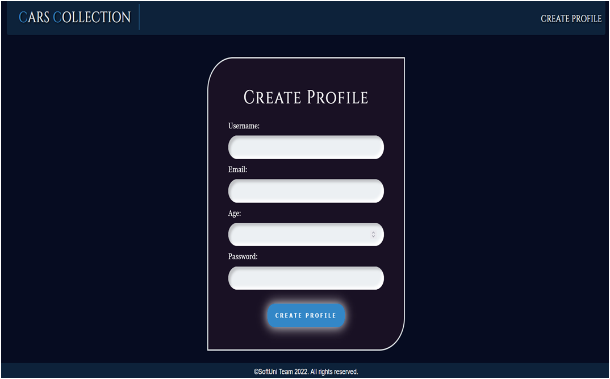

Catalogue Page 
Template file: "catalogue.html"
The catalogue page shows all cars which have been created by the user. 
If the user has a profile, but there are no cars created yet, the page should have the following:
•	A navigation bar, as shown below.
•	A paragraph "No cars yet"

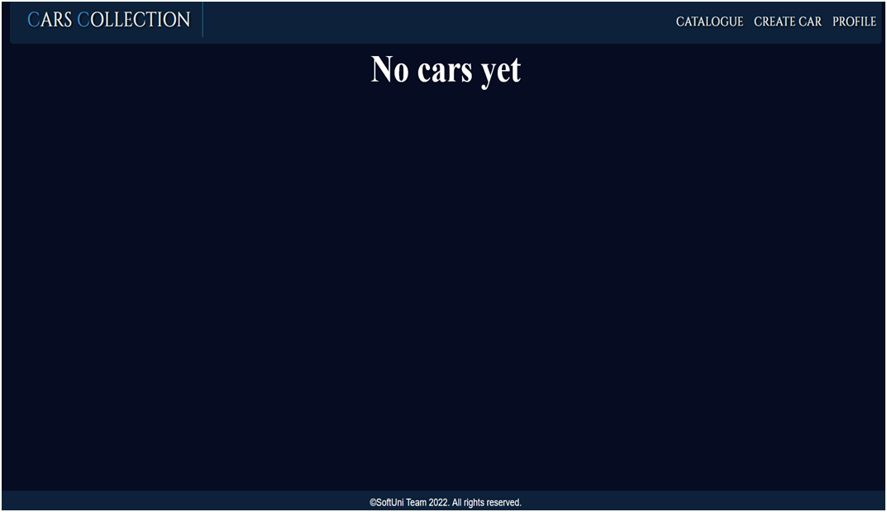

If the user has a profile and cars, the page should have the following:
•	A navigation bar, as shown below.
•	The total number of cars.
•	A division for each car, showing:
o	The car's image
o	The car's type
o	The car's model
o	A button "Details" leading to the details page for the selected game

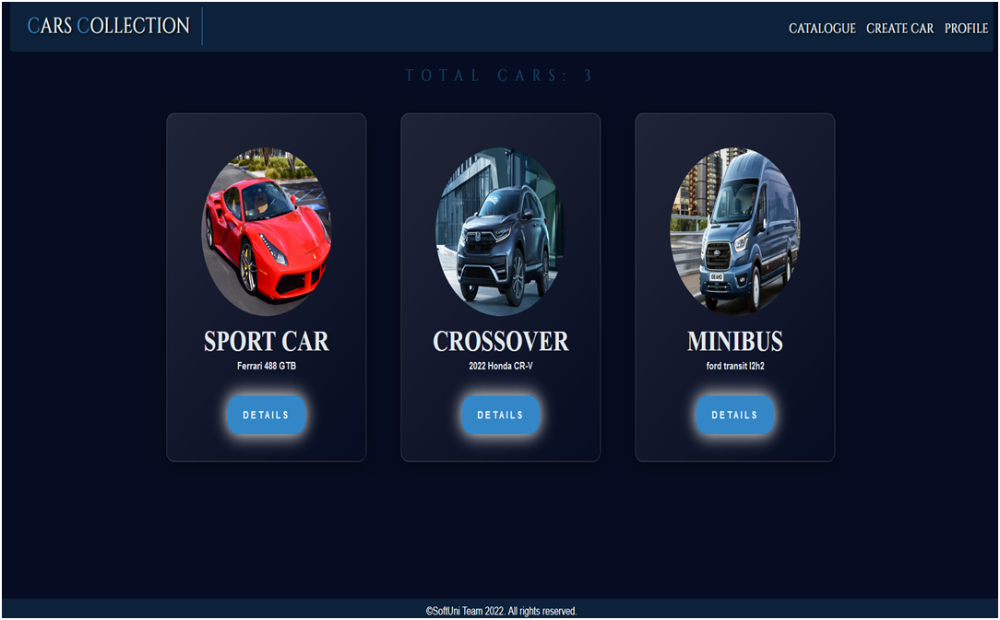

Car Create Page 
Template file: "create-car.html"
The page consists of:
•	A navigation bar, as shown below.
•	A car creation form consisting of:
o	A "Type:" field
o	A "Model:" field
o	An "Year:" field
o	An "Image URL:" field
o	A "Price:" field
•	A button "Create Car"
o	When you click on it, if the car is successfully created, you should be redirected to the catalogue page.
o	Otherwise, the form should show the appropriate validation errors.

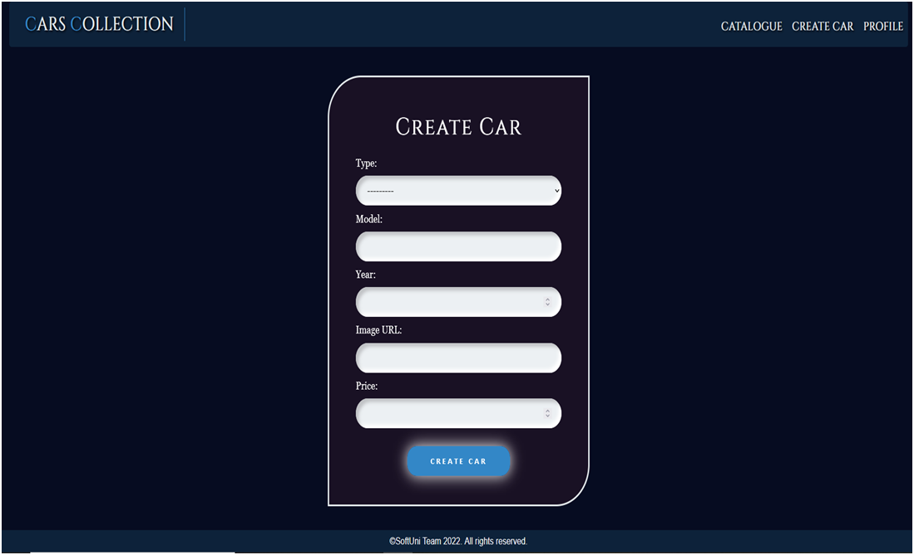

Car Details Page 
Template file: "car-details.html" 
This page contains a car's information. It should have the following:
o	The car's image
o	The car's type
o	The car's model
o	The car's year
o	The car's price, formatted to the 3rd decimal place
o	An "Edit" button that leads to the edit car page
o	A "Delete" button that leads to the delete car page

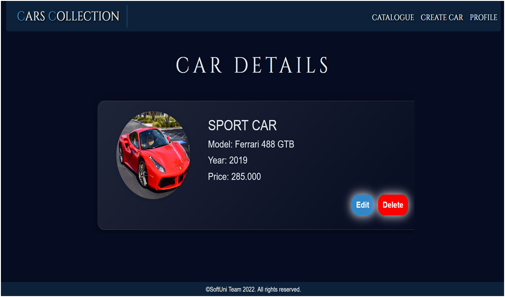

Car Edit Page 
Template file: "edit-car.html"
On the page, the form must be filled with the information of the car we want to edit. 
When you click on the "Edit Car" button:
o	If the car is successfully edited, you should be redirected to the catalogue page.
o	Otherwise, the form should show the appropriate validation errors.

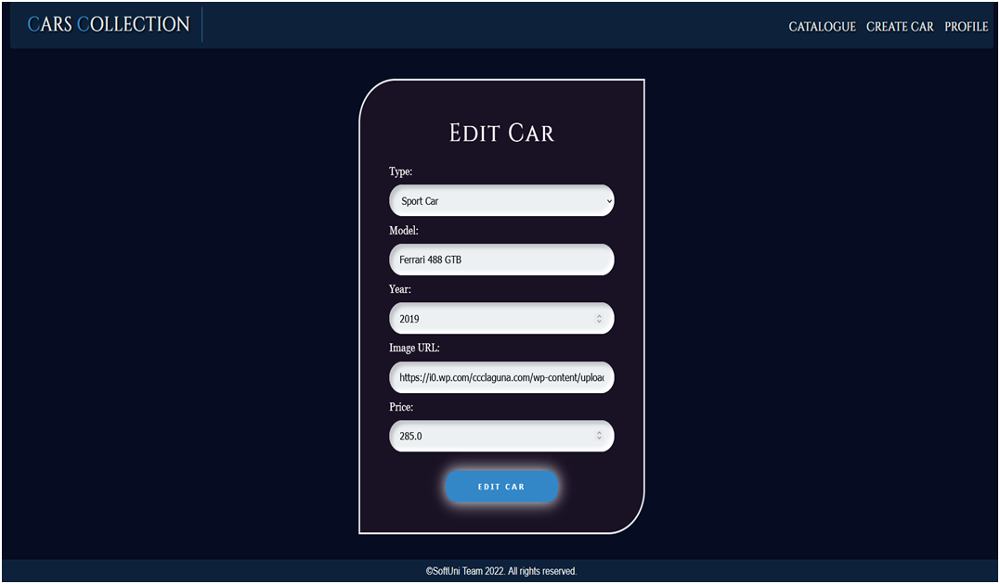

Car Delete Page 
Template file: "delete-car.html"
On the page, the form must be filled with the car's information, and all the fields should be disabled. When you click on the "Delete Car" button, the car is deleted from the database, and you should be redirected to the catalogue page.
The deleted car should be no longer visible in the app.

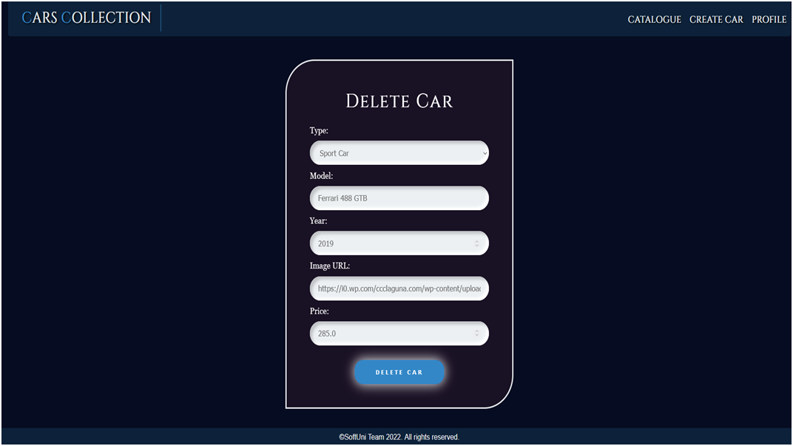

Profile Details Page 
Template file: "profile-details.html"
This page contains the user's information. It should have the following:
•	A profile picture. If no is given, the page should show a default profile picture (in the static/image folder)
•	A name:
o	If both names are entered, show them separated by a single space
o	If only the first name or only the last name is entered, show the entered name only
o	Otherwise, ignore the line (do not show anything)
•	The username
•	The email
•	The age
•	The total price of all cars, formatted to the 3rd decimal place
•	An "Edit" button that leads to the profile edit page
•	A "Delete" button that leads to the profile delete page

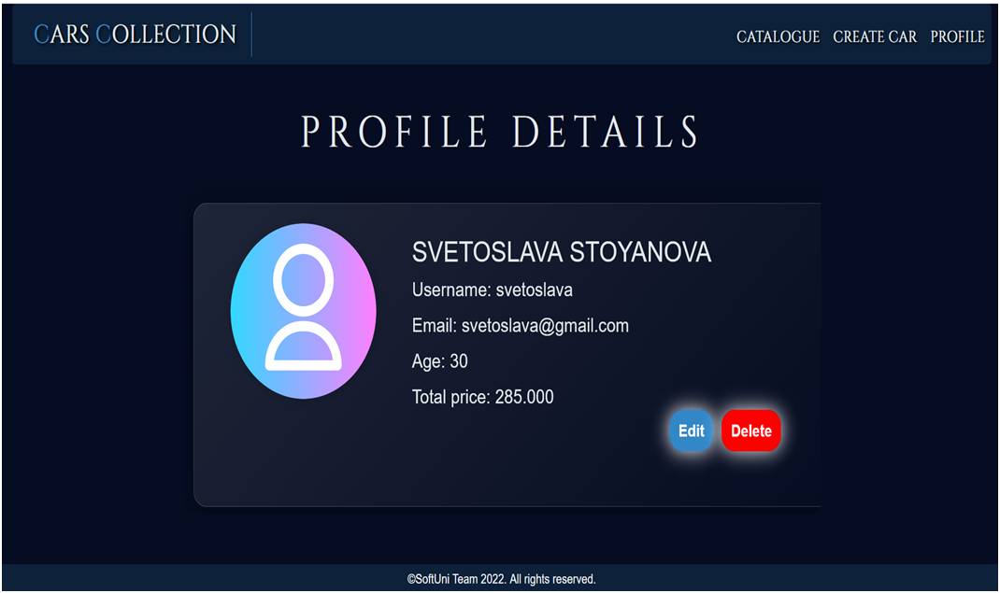

Profile Edit Page 
Template file: "edit-profile.html"
On the page, the form must be filled with the information of the profile we want to edit. The password could be visible or hidden. The profile edition form has additional fields as shown below:
•	A "First Name:" field
•	A "Last Name:" field
•	A "Profile Picture:" field
When you click on the "Edit Profile" button:
•	If the profile is successfully edited, you should be redirected to the profile page.
•	Otherwise, the form should show the appropriate validation errors.

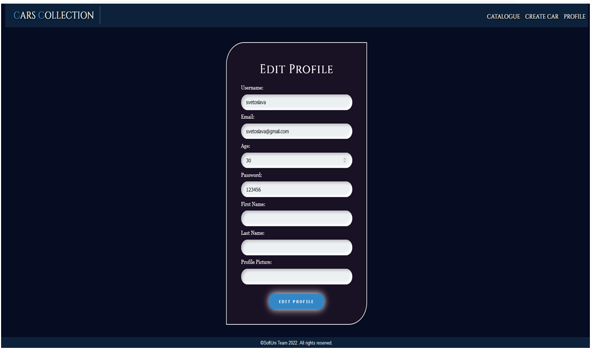

Profile Delete Page 
Template file: "delete-profile.html"
Deleting a profile should delete the profile info and all of his cars. After deletion, the user should be redirected to the index page.

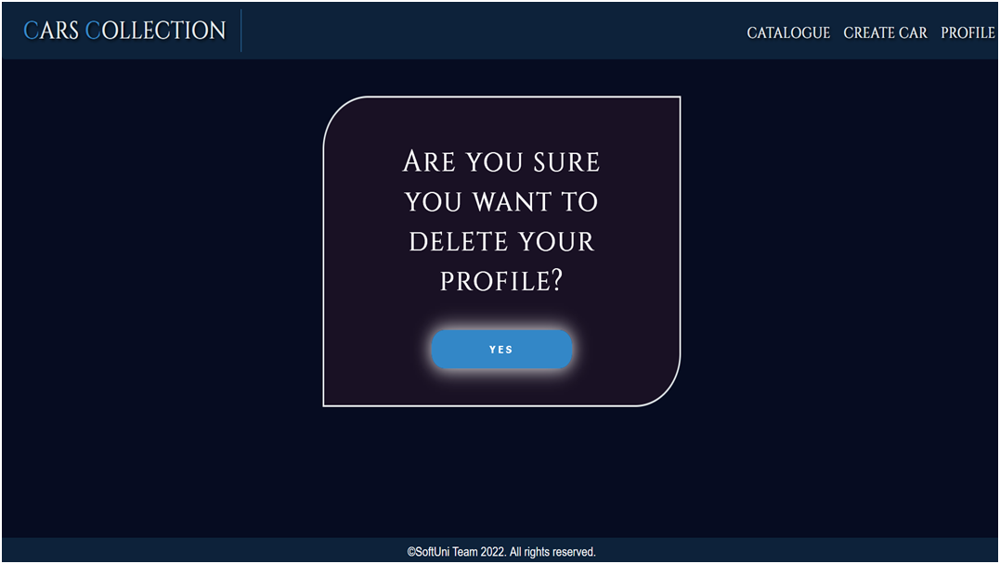

