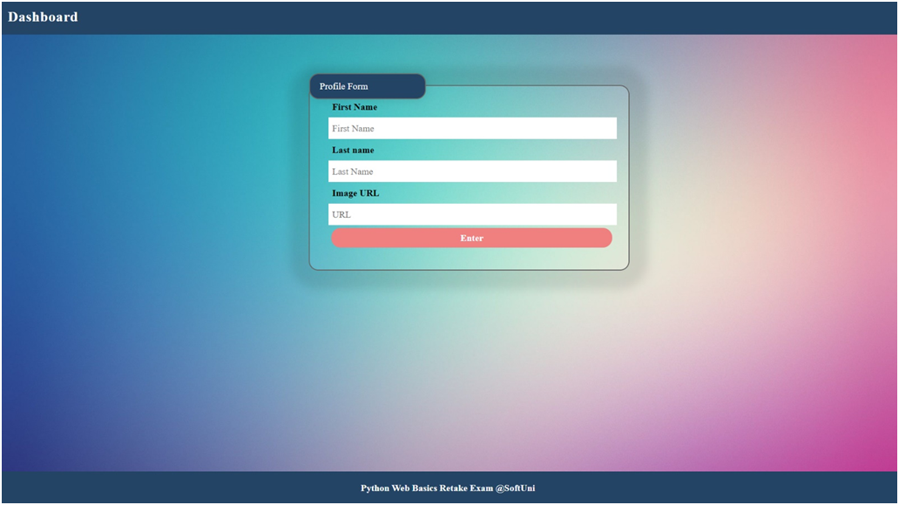
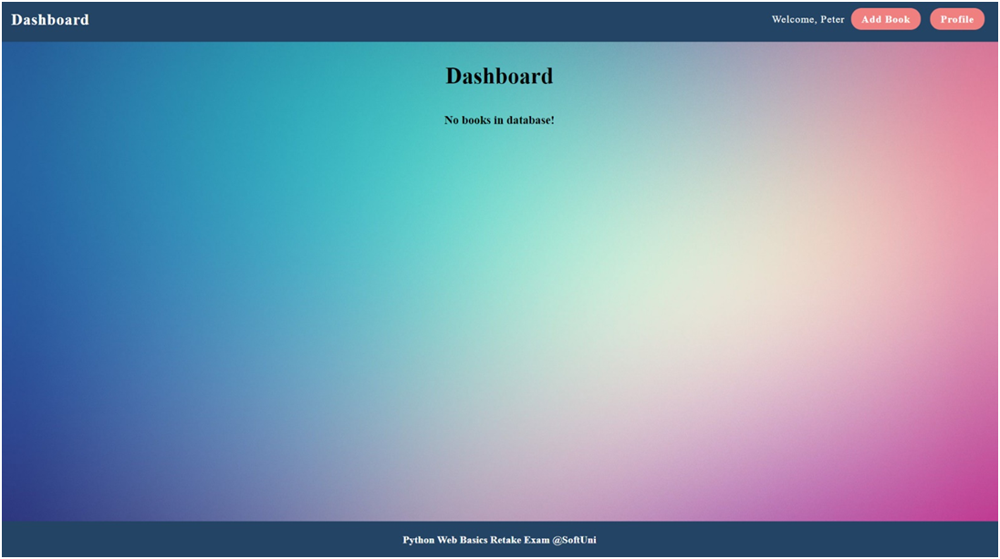
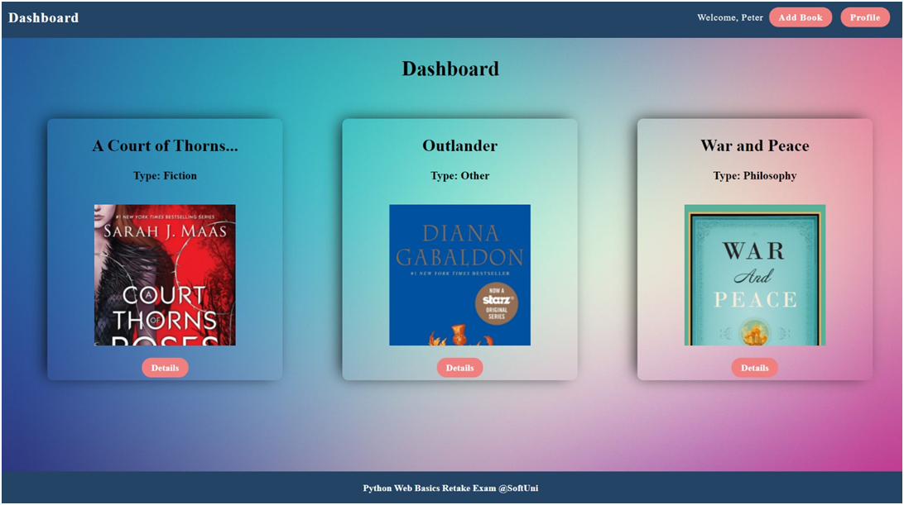
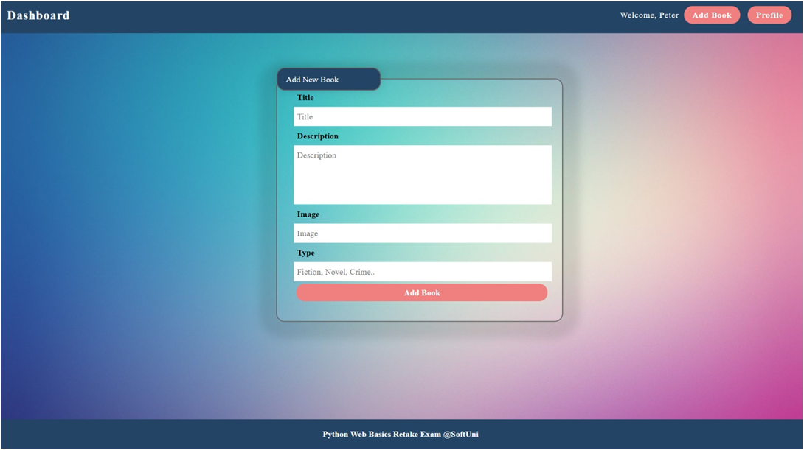
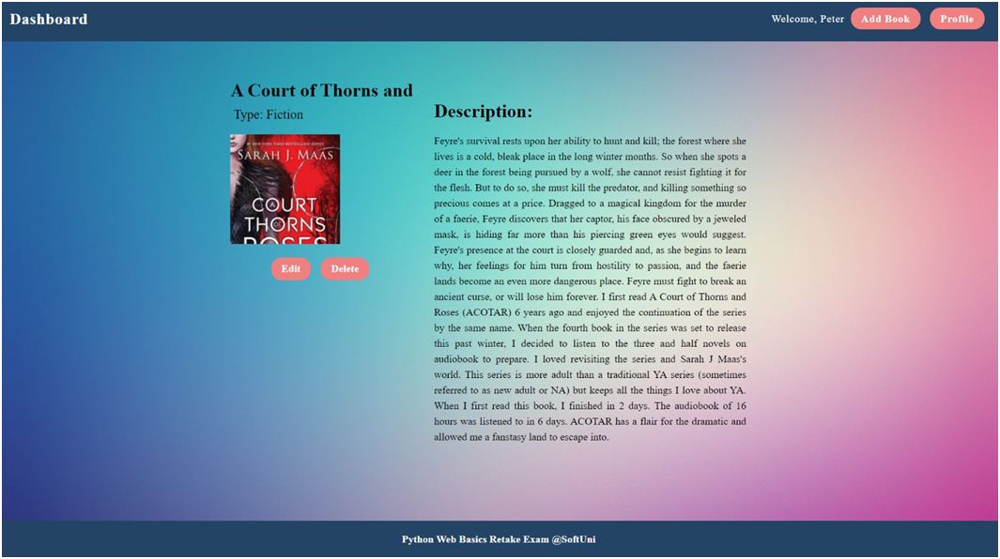
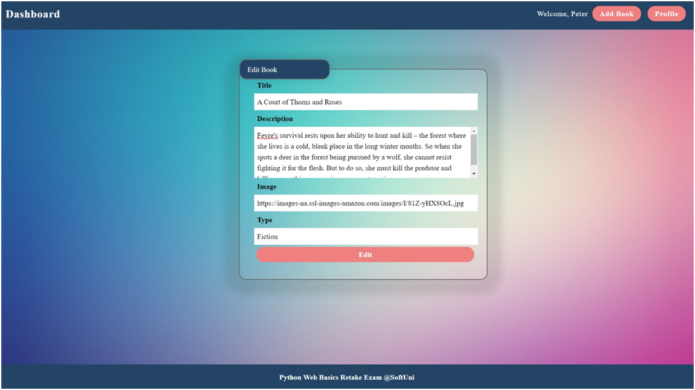
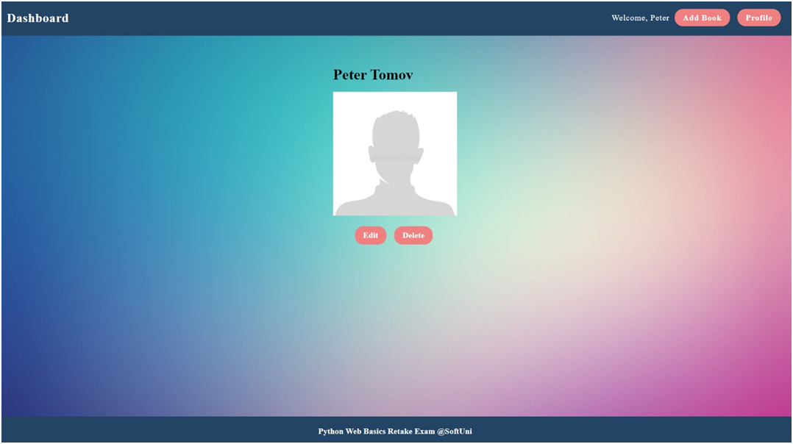
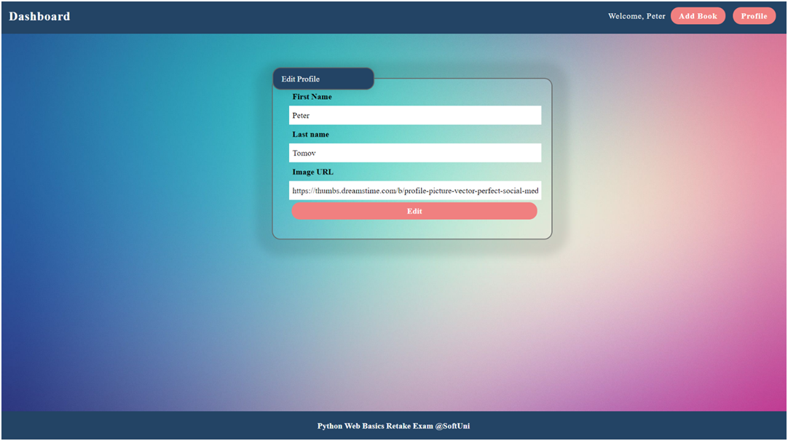
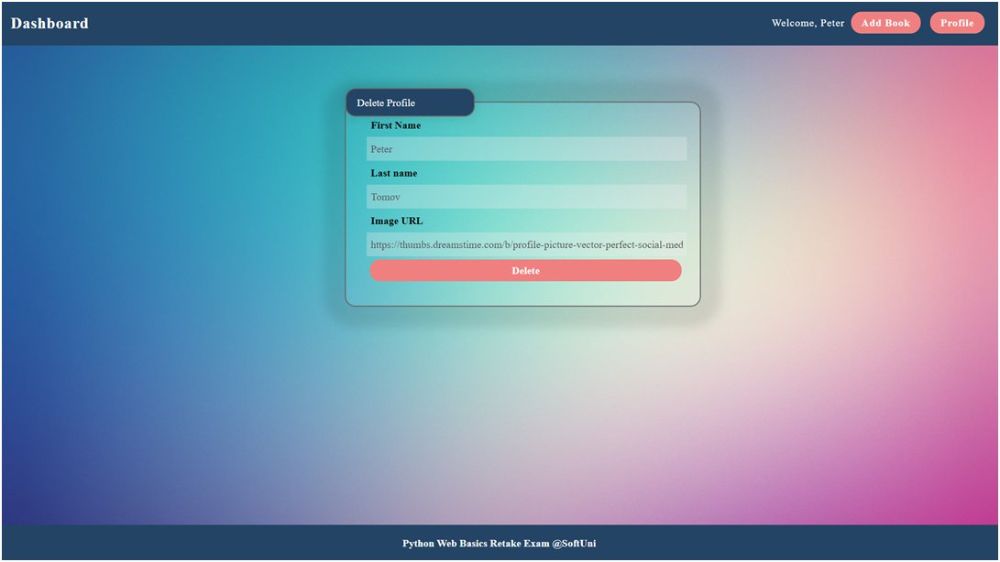

Python Web Basics Exam – Online Library

Online Library is an application where we create our own profiles and manage our books. We can open a details page of each book to see the full content.

1.	Skeleton
You are provided with all the html pages, all the images and the CSS for the project.

2.	Database
You will need 2 models:
•	Profile
o	first_name - Character field with max length of 30 characters
o	last_name - Character field with max length of 30 characters
o	image_url - URL field
•	Book
o	title - Character field with max length of 30 characters
o	description - Text field
o	image - URL field
o	type - Character field with max length of 30 characters

3.	Routes
•	http://localhost:8000/ - home page
•	http://localhost:8000/add/ - add book page
•	http://localhost:8000/edit/:id - edit book page
•	http://localhost:8000/details/:id - book details page
•	http://localhost:8000/profile/ - profile page
•	http://localhost:8000/profile/edit/ - edit profile page
•	http://localhost:8000/profile/delete/ - delete profile page

4.	Pages
Home Page – 20p
If there is no profile created yet:

If a profile has been created and there are no books:

If there is a profile and books. You should display maximum of 3 books on a single line (the next 3 books should be positioned below, on a second line):

Add Book Page – 15p
After the button "Add Book" is clicked, add the book and redirect to home:

Book Details Page – 15p
Fill the needed data: title, type, image, and description. Also, the view should have two buttons – "Edit" and "Delete". When the button "Delete" is clicked, delete the book and redirect to home. When the "Edit" button is clicked, redirect to edit book page.

Edit Book Page – 10p
The form must be filled with the data of the book we want to edit. When the button "Edit" is clicked, edit the book and redirect to home.

Profile Page – 15p
Fill the needed data: names and picture. Also, the view should have two buttons – "Edit" and "Delete":

Edit Profile Page – 5p
The form must be filled with the data of the created profile. When the button "Edit" is clicked, edit the profile and redirect to profile page.

Delete Profile Page – 20p
The form must be filled with the data of the created profile and the fields should be disabled. When the button "Delete" is clicked, delete the profile, all the books and redirect to home.

