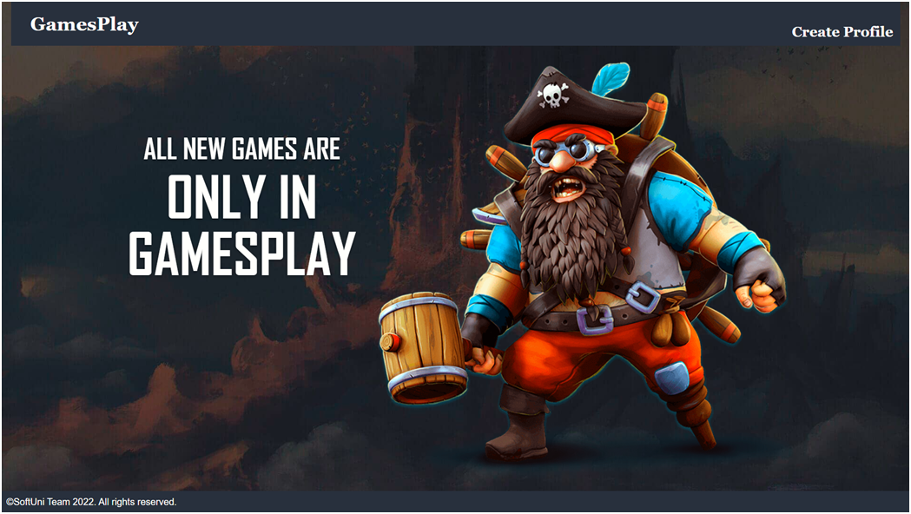
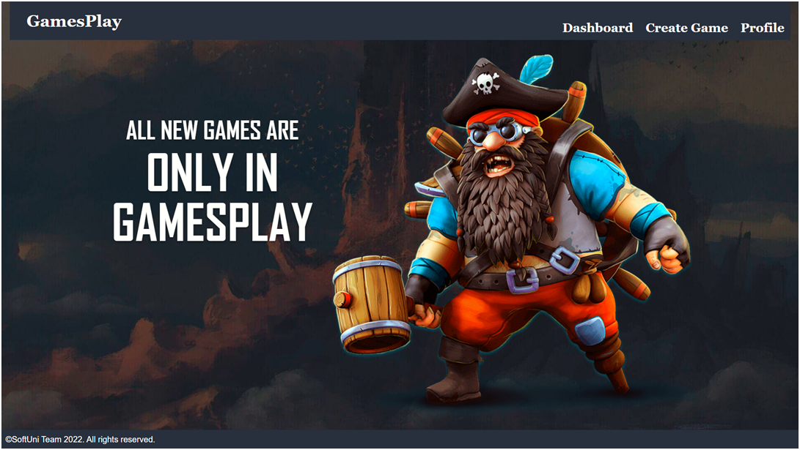
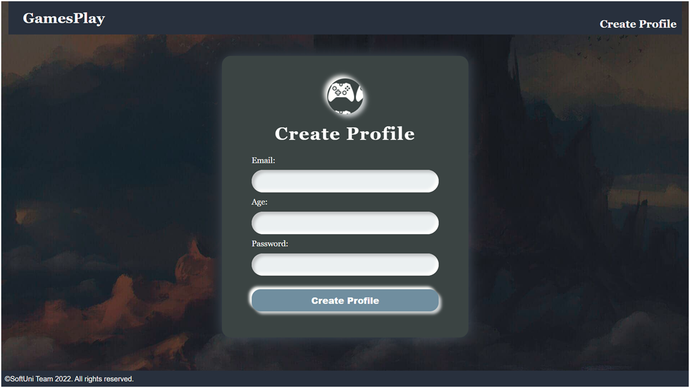
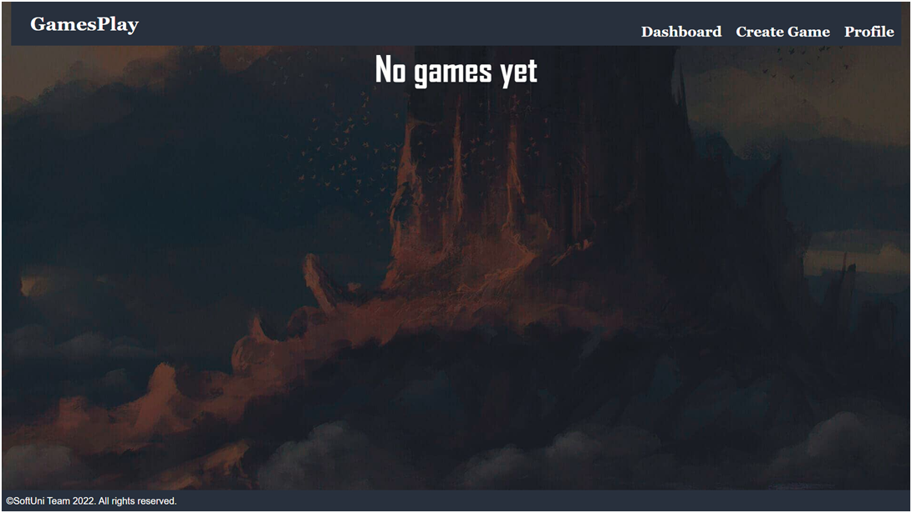
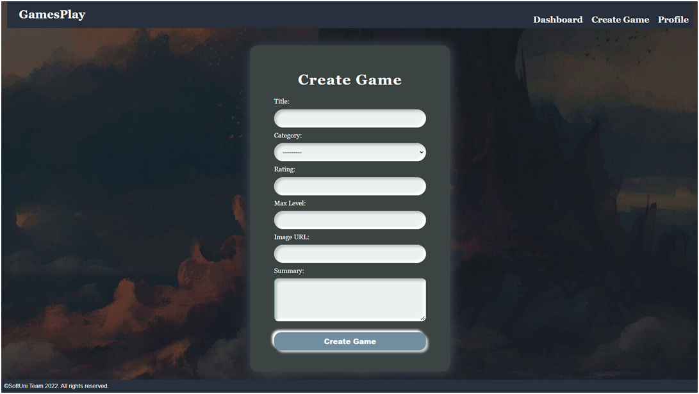
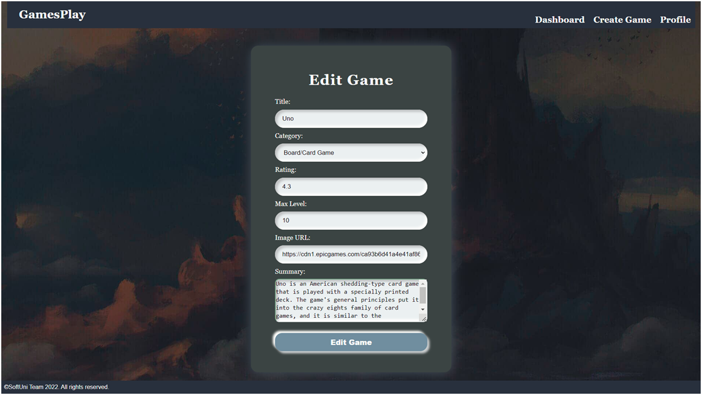
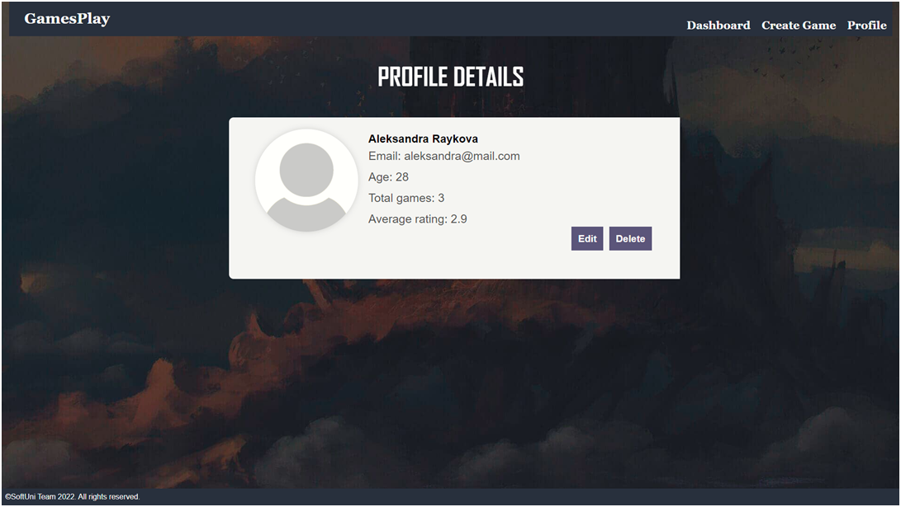
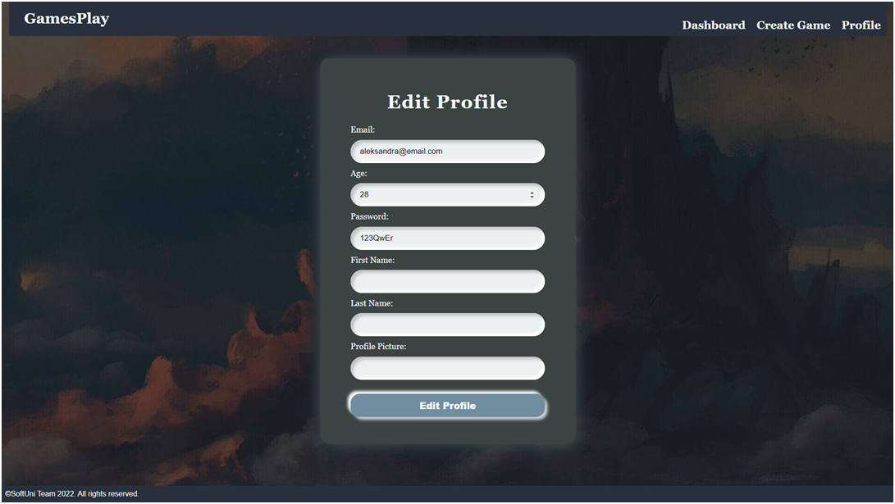
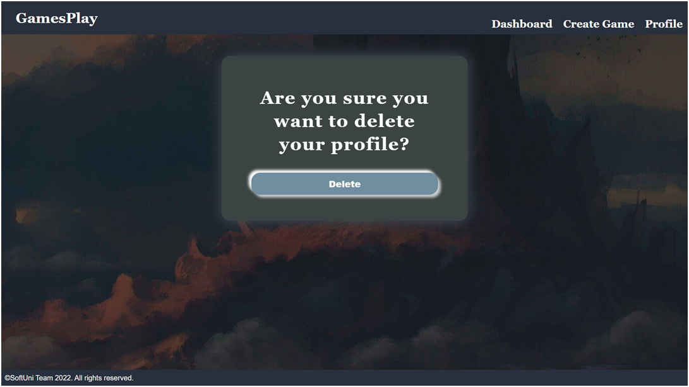

GamesPlay App - Python Web Basics Retake Exam
The app allows the user to browse different games, including the rating, category, highest experience level, and a summary. The user can create, edit, or delete games at any time. He/ She can also edit or delete his/ her profile.
1.	Skeleton
You are provided with all the needed HTML pages, images, and CSS for the project.
2.	Database
You will need 2 models:
•	Profile Model
o	Email
	Email field, required.
o	Age
	Integer field, required.
	The age cannot be below 12.
o	Password
	Character (password) field, required.
	It should consist of a maximum of 30 characters.
o	First Name
	Character field, optional.
	It should consist of a maximum of 30 characters.
o	Last Name
	Character field, optional.
	It should consist of a maximum of 30 characters.
o	Profile Picture
	URL field, optional.
•	Game Model
o	Title
	Character field, required.
	It should consist of a maximum of 30 characters.
	All game titles must be unique.
o	Category
	Character (choice) field, required.
	It should consist of a maximum of 15 characters.
	The choices are "Action", "Adventure", "Puzzle", "Strategy", "Sports", "Board/Card Game", and "Other".
o	Rating
	Float field, required.
	The rating can be between 0.1 and 5.0 (both inclusive).
o	Max Level
	Integer field, optional.
	The max level cannot be below 1.
o	Image URL
	URL field, required.
o	Summary
	Text field, optional.
Note: the validations will be examined only by the user side, not the admin side.

3.	Routes
•	http://localhost:8000/ - home page
•	http://localhost:8000/profile/create - create profile page
•	http://localhost:8000/dashboard/ - dashboard page
•	http://localhost:8000/game/create/ - create game page
•	http://localhost:8000/game/details/<id>/ - details game page
•	http://localhost:8000/game/edit/<id>/ - edit game page
•	http://localhost:8000/game/delete/<id>/ - delete game page
•	http://localhost:8000/profile/details/ - details profile page
•	http://localhost:8000/profile/edit/ - edit profile page
•	http://localhost:8000/profile/delete/ - delete profile page

4.	Pages

Home Page - 10p
Template file: "home-page.html"
The page consists of:
•	A navigation bar with:
o	"GamesPlay" link, which leads to the home page.
o	"Create Profile" link, which leads to create profile page.
o	"Dashboard" link, which leads to the dashboard page.
o	"Create Game" link, which leads to the create game page.
o	"Profile" link, which leads to the details profile page.
•	"All new games are only in GamesPlay" headline and a default image.
Keep in mind that the "Create Profile" link on the navigation bar is only visible when the user has NOT created a profile yet:

The "Dashboard", "Create Game", and "Profile" links on the navigation bar are only visible when the user has a profile:

Create Profile Page - 10p
Template file: "create-profile.html"
The page consists of:
•	A navigation bar with:
o	"GamesPlay" link, which leads to the home page.
o	"Create Profile" link, which leads to create profile page.
•	A profile creation form consisting of:
o	An "Email:" field
o	An "Age:" field
o	A "Password:" field. In the form, the characters must be hidden.
•	A button "Create Profile"
o	When you click on it, if the profile is successfully created, you should be redirected to the home page.
o	Otherwise, the form should show the appropriate validation errors in the form.

Dashboard Page - 10p
Template file: "dashboard.html"
The dashboard page shows all games created by the user. 
If the user has a profile, but there are no games created, the page should have the following:
•	A navigation bar, as shown below.
•	A paragraph "No games yet"

If the user has a profile and game/s, the page should have the following:
•	A navigation bar, as shown below.
•	A division for each game, showing:
o	The game's image
o	The game's title
o	The game's category
o	A button "Details" leading to the details page for the selected game

Create Game Page - 10p
Template file: "create-game.html"
The page consists of:
•	A navigation bar, as shown below.
•	A game creation form consisting of:
o	A "Title:" field
o	A "Category:" field
o	A "Rating:" field
o	A "Max Level:" field
o	An "Image URL:" field
o	A "Summary:" field
•	A button "Create Game"
o	When you click on it, if the game is successfully created, you should be redirected to the dashboard page.
o	Otherwise, the form should show the appropriate validation errors.

Game Details Page - 10p
Template file: "details-game.html" 
This page contains a game's data. It should have the following:
•	The game's image
•	The game's title
•	The game's rating
•	The game's category
•	The game's max level, if there is any entered; otherwise, ignore the line
•	The game's summary, if there is any entered; otherwise, ignore the line
•	An "Edit" button that leads to the edit game page
•	A "Delete" button that leads to the delete game page

Edit Game Page - 10p
Template file: "edit-game.html"
On the page, the form must be filled with the data of the game we want to edit. 
When you click on the "Edit Game" button:
•	If the game is successfully edited, you should be redirected to the dashboard page.
•	Otherwise, the form should show the appropriate validation errors.

Delete Game Page - 10p
Template file: "delete-game.html"
On the page, the form must be filled with the game's data, and the fields should be disabled. When you click on the "Delete Game" button, the game is deleted from the database, and you should be redirected to the dashboard page.
The deleted game should be no longer visible in the app.

Profile Details Page - 10p
Template file: "details-profile.html"
This page contains the user's data. It should have the following:
•	A profile picture. If no is given, the page should show a default profile picture (in the static/image folder)
•	A name:
o	If both names are entered, show them separated by a single space
o	If only the first name or only the last name is entered, show the entered name only
o	Otherwise, ignore the line (do not show anything)
•	The email
•	The age
•	The total number of games existing at the moment in the app
•	The average rating for all games existing in the app at the moment, if no games show "0.0"
•	An "Edit" button that leads to the edit profile page
•	A "Delete" button that leads to the delete profile page

Edit Profile Page - 10p
Template file: "edit-profile.html"
On the page, the form must be filled with the data of the profile we want to edit. The password could be visible or hidden. The profile edition form has additional fields as shown below:
•	A "First Name:" field
•	A "Last name:" field
•	A "Profile Picture:" field
When you click on the "Edit Profile" button:
•	If the profile is successfully edited, you should be redirected to the profile page.
•	Otherwise, the form should show the appropriate validation errors.

Delete Profile Page - 10p
Template file: "delete-profile.html"
Deleting a profile should delete the profile info and all games. After deletion, the user should be redirected to the home page.

