                    MyPlant App - Python Web Basics Exam

The app allows the user to browse different plants including their price, description, name, and type. The user can create, edit, or delete plants at any time. He/ She can also edit or delete his/ her profile.
1. Skeleton
You are provided with all the needed HTML pages, images, and CSS for the project.
2. Database
You will need 2 models:
•	Profile Model
o	Username
	Character field, required.
	It should consist of a maximum of 10 characters.
	It should consist of a minimum of 2 characters
o	First name
	Character field, required.
	It should consist of a maximum of 20 characters.
	The first name must start with a capital letter. Otherwise raise ValidationError with the following message: "Your name must start with a capital letter!"
o	Last Name
	Character field, required.
	It should consist of a maximum of 20 characters.
	The last name must start with a capital letter. Otherwise raise ValidationError with the following message: "Your name must start with a capital letter!"
o	Profile Picture
	URL field, optional.
•	Plant Model
o	Plant Type
	Character field, required.
	It should consist of a maximum of 14 characters.
	The choices are: "Outdoor Plants" and "Indoor Plants".
o	Name
	Character field, required.
	It should consist of a maximum of 20 and a minimum of 2 characters.
	The name should contain only letters. Otherwise raise a ValidationError with the following message: "Plant name should contain only letters!"
o	Image Url
	URL field, required.
o	Description
	Text field, required.
o	Price
	Float field, required.
Note: the project will be examined only on the user side; models will NOT be tested on the admin site with a superuser profile.
3. Routes
•	http://localhost:8000/ - home page
•	http://localhost:8000/profile/create/ - profile create page
•	http://localhost:8000/catalogue/ - catalogue
•	http://localhost:8000/create/ - plant create page
•	http://localhost:8000/details/<plant_id>/ - plant details page
•	http://localhost:8000/edit/<plant_id>/ - plant edit page
•	http://localhost:8000/delete/<plant_id>/ - plant delete page
•	http://localhost:8000/profile/details/ - profile details page
•	http://localhost:8000/profile/edit/ - profile edit page
•	http://localhost:8000/profile/delete/ - profile delete page

4. Pages
Home page - 10p
Template file: "home-page.html"
The page consists of:
•	A navigation bar with:
•	"MyPlants" link, which leads to the home page.
•	"Create Profile" link, which leads to create profile page.
•	"Catalogue" link, which leads to the catalogue page.
•	"Create Plant" link, which leads to the create plant page.
•	"Profile" link, which leads to the profile details page.
Keep in mind that the "Create Profile" link on the navigation bar is only visible when the user has NOT created a profile yet: 

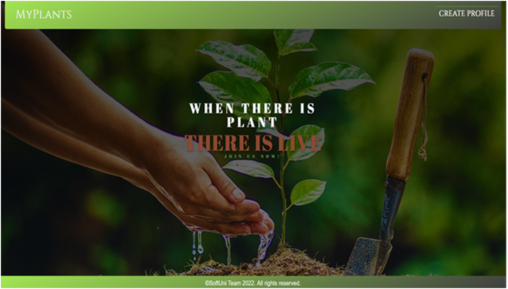

The "Catalogue", "Create Plant", and "Profile" links on the navigation bar are only visible when the user has a profile:

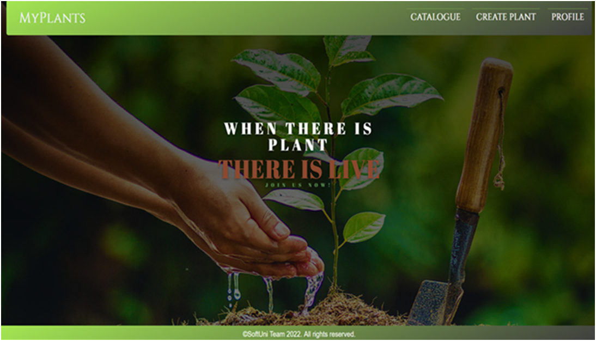

Create Profile Page - 10p
Template file: "create-profile.html"
The page consists of:
•	A navigation bar with:
•	"MyPlants" link, which leads to the home page.
•	"Create Profile" link, which leads to create profile page.
•	A profile creation form consisting of:
•	An "Username" field
•	An "First Name:" field
•	An "Last Name:" field
•	A button "Create Profile"
•	When you click on it, if the profile is successfully created, you should be redirected to the catalogue page.
•	Otherwise, the form should show the appropriate validation errors in the form.

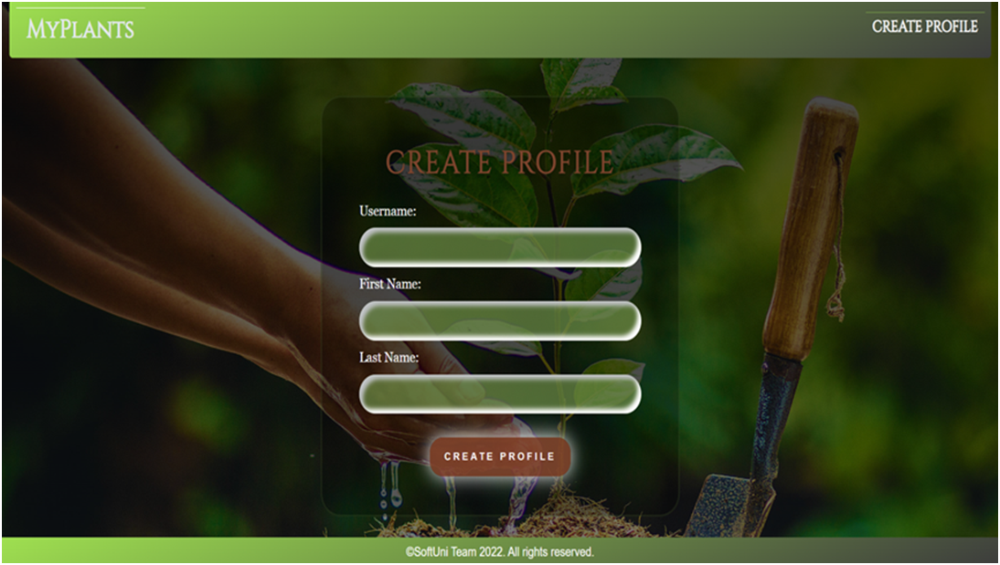

Catalogue Page - 10p
Template file: "catalogue.html"
The catalogue page shows all plants which have been created by the user. 
If the user has a profile, but there are no plants created yet, the page should have the following:
•	A navigation bar, as shown below.
•	A paragraph "No plants yet"

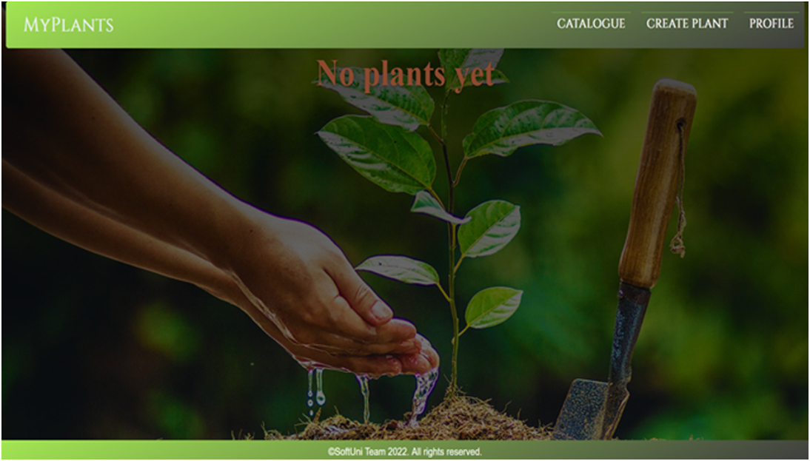

If the user has a profile and plants, the page should have the following:
•	A navigation bar, as shown below.
•	A division for each plant, showing:
•	The plant's image
•	The plant's name
•	The plant's description. The description should show only the first 20 characters!
•	A button "Details" leading to the details page for the selected plant

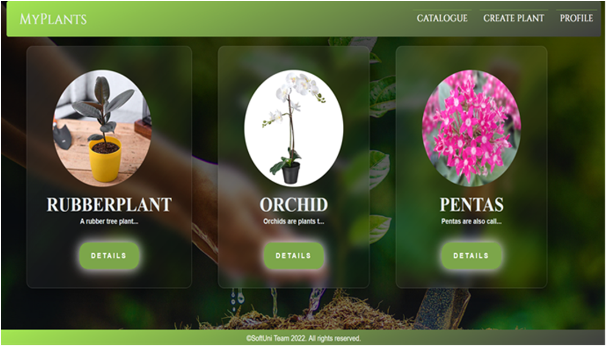

Create Plant Page - 10p
Template file: "create-plant.html"
The page consists of:
•	A navigation bar, as shown below.
•	A plant creation form consisting of:
•	A "Type:" field
•	A "Name":" field
•	An "Image Url:" field
•	An "Description:" field
•	A "Price:" field
•	A button "Create Plant"
•	When you click on it, if the plant is successfully created, you should be redirected to the catalogue page.
•	Otherwise, the form should show the appropriate validation errors.

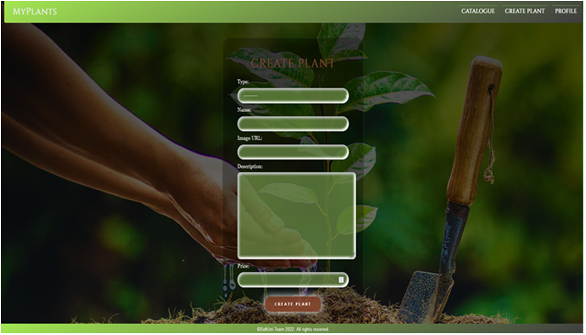

Plant Details Page - 10p
Template file: "plant-details.html" 
This page contains a plant’s information. It should have the following:
•	The plant's image
•	The plant's type
•	The plant's name
•	The plant's price, formatted to the second decimal place
•	The plant's description
•	An "Edit" button that leads to the edit plant page
•	A "Delete" button that leads to the delete plant page

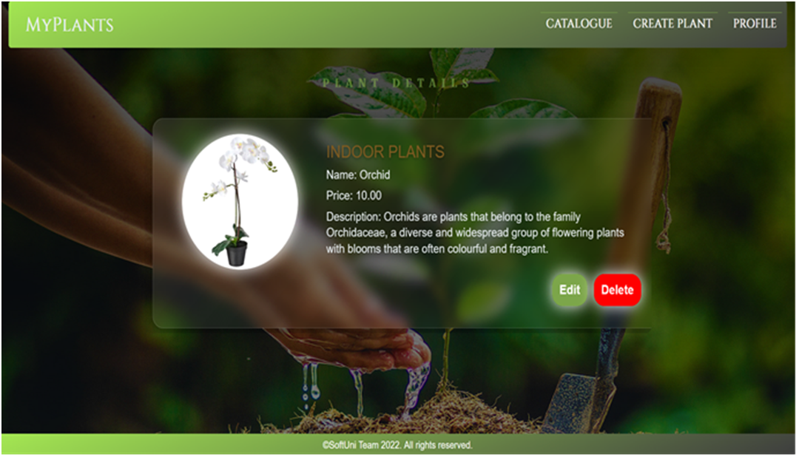

Edit Plant Page - 10p
Template file: "edit-plant.html"
On the page, the form must be filled with information about the plant we want to edit.
When you click on the "Edit Plant" button:
•	If the plant is successfully edited, you should be redirected to the catalogue page.
•	Otherwise, the form should show the appropriate validation errors.

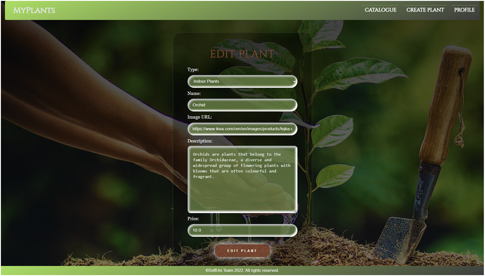

Delete Plant Page - 10p
Template file: "delete-plant.html"
On the page, the form must be filled with the plant's information, and all the fields should be disabled. When you click on the "Delete Plant" button, the plant is deleted from the database, and you should be redirected to the catalogue page.
The deleted plant should be no longer visible in the app.

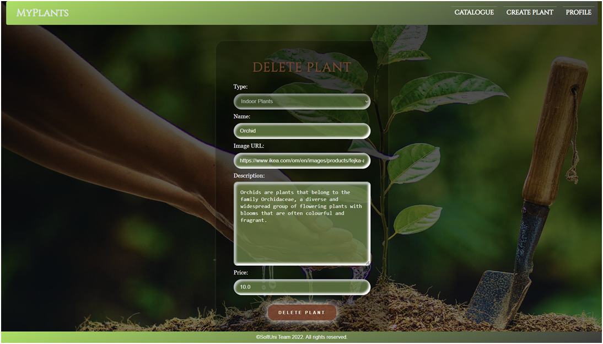

Profile Details Page - 10p
Template file: "profile-details.html"
This page contains the user's information. It should have the following:
•	A profile picture. If no picture is given, the page should show a default profile picture (in the static/image folder)
•	First name and last name:
•	The username
•	The total stars that the user has. They will depend on how many plants the user got:
o	If he got one plant, the star must be one
o	If he got two plants, the stars must be two
o	If he got three or more plants, the stars must be three
o	If the user doesn't have any plants, no stars must be shown and you must only see the following text: "Total stars: 0"
•	An "Edit" button that leads to the edit profile page
•	A "Delete" button that leads to the delete profile page
If the user has one or more plants:

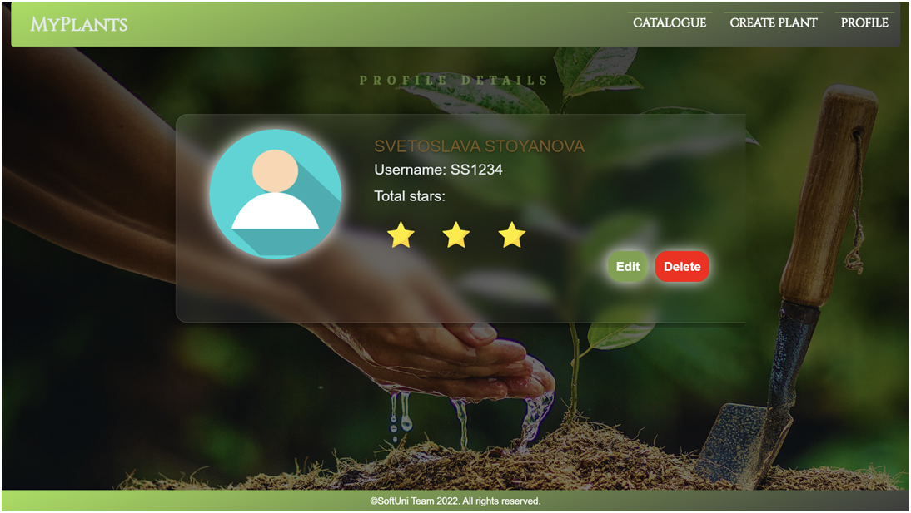

If the user doesn't have any plants: 

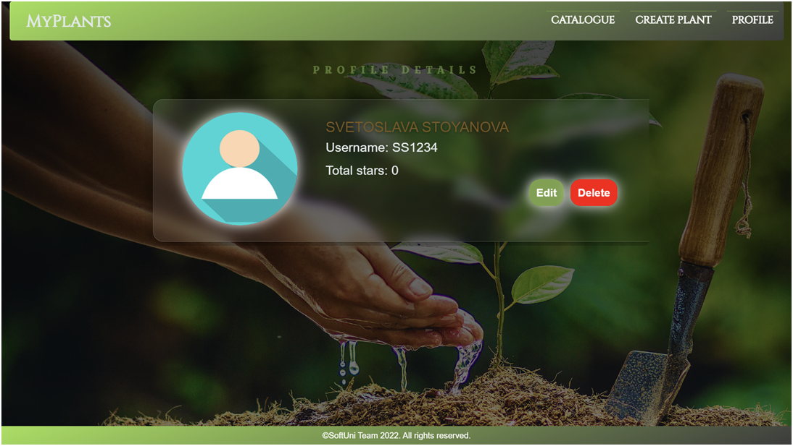

Edit Profile Page - 10p
Template file: "edit-profile.html"
On the page, the form must be filled with the information of the profile we want to edit. The profile edition form has additional fields as shown below:
•	A "Username:" field
•	A "First Name:" field
•	A "Second Name:" field
•	A "Profile Picture:" field
When you click on the "Edit Profile" button:
•	If the profile is successfully edited, you should be redirected to the profile details page.
•	Otherwise, the form should show the appropriate validation errors.

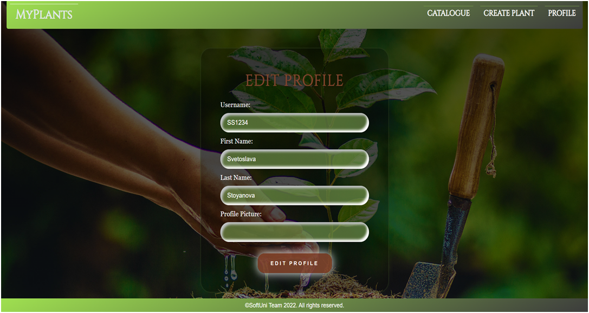

Delete Profile Page - 10p
Template file: "delete-profile.html"
Deleting a profile should delete the profile info and all of his /her added plants. After deletion, the user should be redirected to the home page.

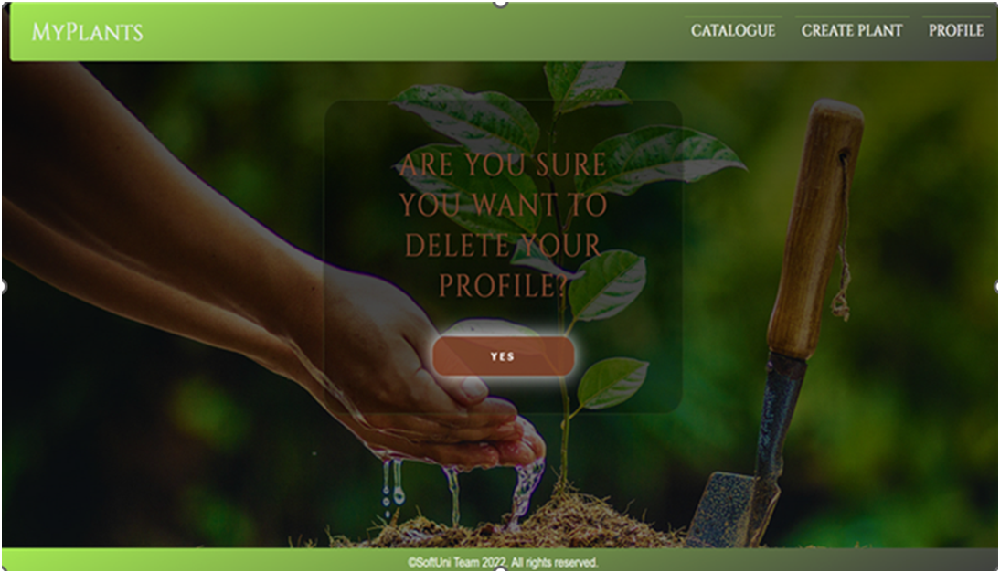