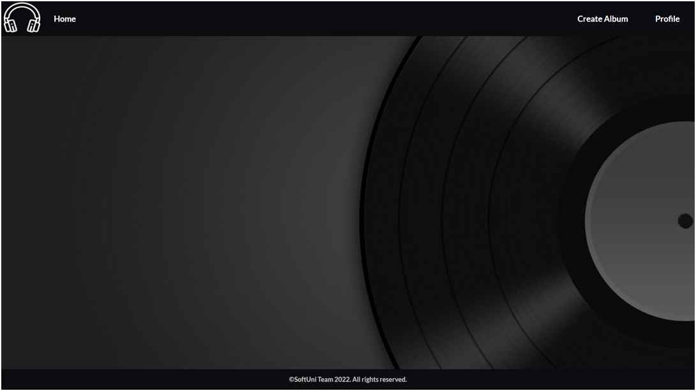
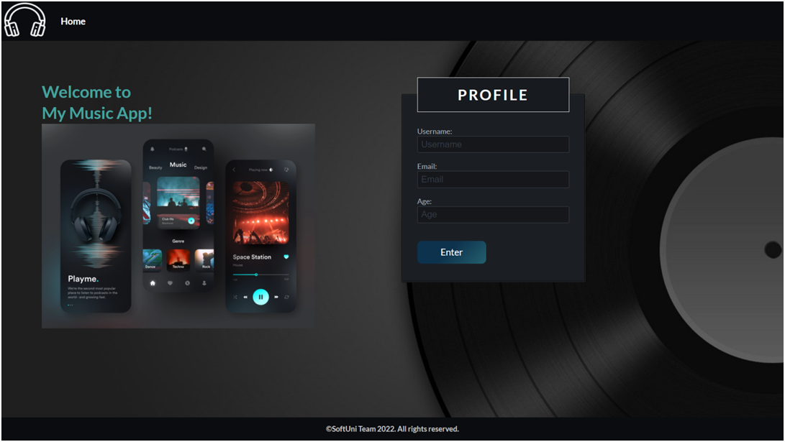
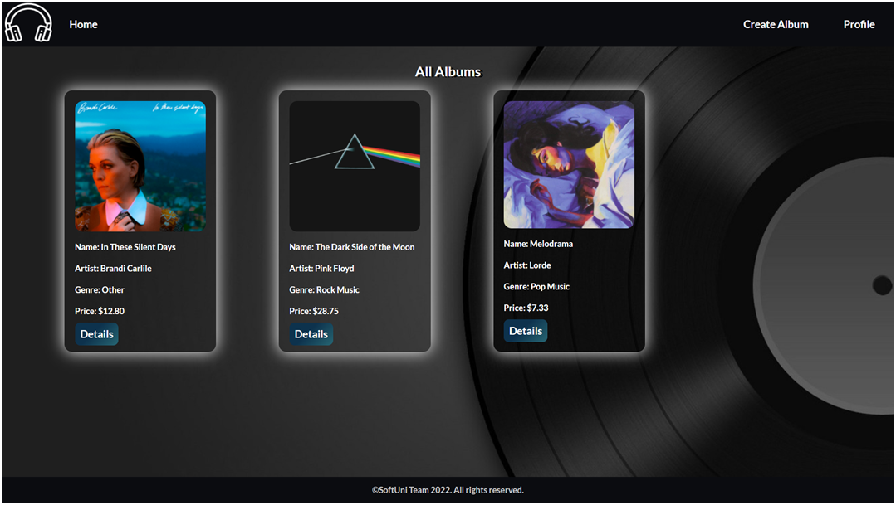
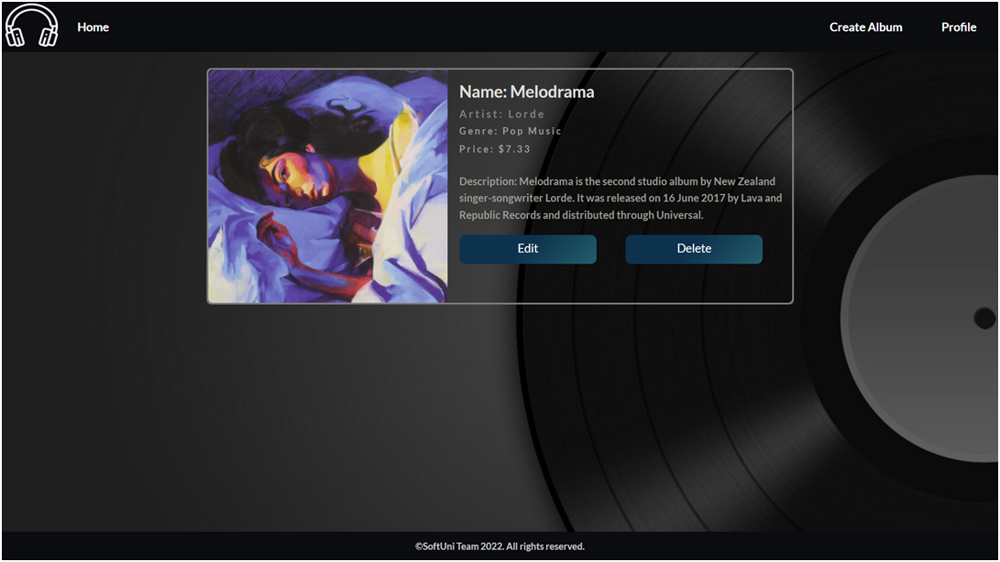

            My Music App - Python Web Basics Exam

The app allows a user to browse different albums, including the author, genre, and price. The user can create a catalog of albums. Album creators can also edit or delete their posts at any time.
1.	Skeleton
You are provided with all the needed HTML pages, images, and CSS for the project.
2.	Database
You will need 2 models:
•	Profile
o	Username
	Character field, required.
	 It should have at least 2 characters and maximum - 15 characters.
	The username can consist only of letters, numbers, and underscore ("_"). Otherwise, raise a ValidationError with the message: "Ensure this value contains only letters, numbers, and underscore."
o	Email
	Email field, required.
o	Age
	Integer field, optional.
	The age cannot be below 0.
•	Album
o	Album Name
	Character field, required.
	All album names must be unique.
	 It should consist of a maximum of 30 characters.
o	Artist
	Character field, required.
	It should consist of a maximum of 30 characters.
o	Genre
	Char field, required.
	It should consist of a maximum of 30 characters.
	The choices are "Pop Music", "Jazz Music", "R&B Music", "Rock Music", "Country Music", "Dance Music", "Hip Hop Music", and "Other".
o	Description
	Text field, optional.
o	Image URL
	URL field, required.
o	Price
	Float field, required.
	The number of decimal places of the price should not be specified in the database.
	The price cannot be below 0.0.
Note: the validations will be examined only by the user side, not the admin side.
3.	Routes
•	http://localhost:8000/ - home page
•	http://localhost:8000/album/add/ - add album page
•	http://localhost:8000/album/details/<id>/ - album details page
•	http://localhost:8000/album/edit/<id>/ - edit album page
•	http://localhost:8000/album/delete/<id>/ - delete album page
•	http://localhost:8000/profile/details/ - profile details page
•	http://localhost:8000/profile/delete/ - delete profile page
4.	Pages
Base Template - 8p
Template file: "base.html"
The template is a base for all the templates in the project. It consists of the metadata for the project (in the <head> tag), the navigation bar, and the footer of each web page. On the navigation bar:
•	The "Home" button leads to the home page.
•	The "Create Album" button leads to create album page.
•	The "Profile" button leads to the profile page. 
Keep in mind that the "Create Album" and the "Profile" buttons on the navigation bar are only visible when the user has a profile.
There is no path to this template, and it is NOT accessible via URL:

Home Page - 22p
Template files: "home-no-profile.html"; "home-with-profile.html"
If there is no profile created yet, the home page shows a form for profile creation. It consists of:
•	A "Username:"
o	There must be a placeholder "Username".
•	An "Email:"
o	There must be a placeholder "Email".
•	An "Age:"
o	There must be a placeholder "Age".
•	A button "Enter". 
o	When you click on it, if the profile is successfully created, you should be redirected to the same page, showing a template for a home page with a profile.
o	Otherwise, the form should show the appropriate validation errors.

The home with a profile page shows all albums created by the user. When there are no albums created, you can only see the paragraph "No Albums in Catalog!":

If there are a profile and album/s, the page should have the following:
•	A navigation bar, as shown bellow.
•	A headline "All Albums"
•	A card-box for each album, showing the album's image, name, artist, genre, and price (formatted to the second decimal place). There should be a button "Details" in each card-box leading to the album details page for the selected album.

Add Album Page - 15p
Template file: "add-album.html"
This page loads an album creation form consisting of:
•	An "Album Name:"
o	There must be a placeholder "Album Name".
•	An "Artist:"
o	There must be a placeholder "Artist".
•	A "Genre:"
o	The user must choose one of the given choices above (in the Database section).
•	A "Description:" 
o	There must be a placeholder "Description".
•	An "Image URL:"
o	There must be a placeholder "Image URL".
•	A "Price:" fields
o	There must be a placeholder "Price".
•	A button "Add New Album"
o	When you click on it, if the album is successfully created, you should be redirected to the home page, showing a template for a home page with a profile.
o	Otherwise, the form should show the appropriate validation errors.

Album Details Page - 10p
Template file: "album-details.html"
This page contains an album's data. It should have the following:
•	The album image
•	The album name
•	The artist name
•	The genre
•	The price of the album, formatted to the second decimal place
•	The description, if there is any entered; otherwise, ignore the line
•	An "Edit" button that leads to the edit album page
•	A "Delete" button that leads to the delete album page

Edit Album Page - 10p
Template file: "edit-album.html"
On the page, the form must be filled with the data of the album we want to edit.
Note: the price should have no limit on the amount of decimal places both when it's shown and when it's edited. 
When you click on the "Edit Album" button:
•	If the album is successfully edited, you should be redirected to the home page, showing a template for a home page with a profile.
•	Otherwise, the form should show the appropriate validation errors.

Delete Album Page - 10p
Template file: "delete-album.html"
On the page, the form must be filled with the album's data, and the fields should be disabled. When you click on the "Delete" button, the album is deleted from the database, and you should be redirected to the home page, showing a template for a home page with a profile.
The deleted album should be no longer visible in the app.

Profile Details Page - 10p
Template file: "profile-details.html"
This page contains the user's data. It should have the following:
•	The default profile image (as a source link in the HTML code)
•	The username
•	The email
•	The age, if it is entered; Otherwise, ignore the line (do not show anything)
•	The total number of albums existing at the moment in this app
•	A "Delete" button that leads to the delete profile page

Delete Profile Page - 15p
Template file: "profile-delete.html"
Deleting a profile should delete the profile info and all albums. After deletion, the user should be redirected to the home page with no profile.

