                    Fruitipedia App - Python Web Basics Exam

The app allows the user to browse different fruits including their nutrition info, description, name, and image. The user can create, edit, or delete fruits at any time. He/ She can also edit or delete his/ her profile.
1.	Skeleton
You are provided with all the needed HTML pages, images, and CSS files for the project.
2.	Database
You will need 2 models:
•	Profile Model
o	First Name
	Character field, required.
	It should consist of a maximum of 25 characters and a minimum of 2 characters.
	The first name must start with a letter. Otherwise raise ValidationError with the following message: "Your name must start with a letter!"
o	Last Name
	Character field, required.
	It should consist of a maximum of 35 characters and a minimum of 1 character.
	The last name must start with a letter. Otherwise raise ValidationError with the following message: "Your name must start with a letter!"
o	Email
	Email field, required.
	It should consist of a maximum of 40 characters.
o	Password
	Character (password) field, required.
	It should consist of a maximum of 20 characters and a minimum of 8 characters.
o	Image URL
	URL field, optional.
o	Age
	Integer field, optional.
	The age default value should be 18.

•	Fruit Model
o	Name
	Character field, required.
	It should consist of a maximum of 30 and a minimum of 2 characters.
	The name should contain only letters. Otherwise raise a ValidationError with the following message: "Fruit name should contain only letters!"
o	Image URL
	URL field, required.
o	Description
	Text field, required.
o	Nutrition
	Text field, optional.
Note: the project will be examined only on the user side; models will NOT be tested on the admin site with a superuser profile.
3.	Routes
•	http://localhost:8000/ - index page
•	http://localhost:8000/dashboard/ - dashboard page
•	http://localhost:8000/create/ - fruit create page
•	http://localhost:8000/<fruitId>/details/ - fruit details page
•	http://localhost:8000/<fruitId>/edit/ - fruit edit page
•	http://localhost:8000/<fruitId>/delete/ - fruit delete page
•	http://localhost:8000/profile/create/ - profile create page
•	http://localhost:8000/profile/details/ - profile details page
•	http://localhost:8000/profile/edit/ - profile edit page
•	http://localhost:8000/profile/delete/ - profile delete page

4.	Pages
Index page - 10p
Template file: "index.html"
The page consists of:
•	A navigation bar with:
•	"Fruitipedia" link, which leads to the index page.
•	"Create Profile" link, which leads to create profile page.
•	"Dashboard" link, which leads to the dashboard page.
•	"Add Fruit" link, which leads to the create fruit page.
•	"Profile" link, which leads to the profile details page.
Keep in mind that the "Create Profile" link on the navigation bar is only visible when the user has NOT created a profile yet: 

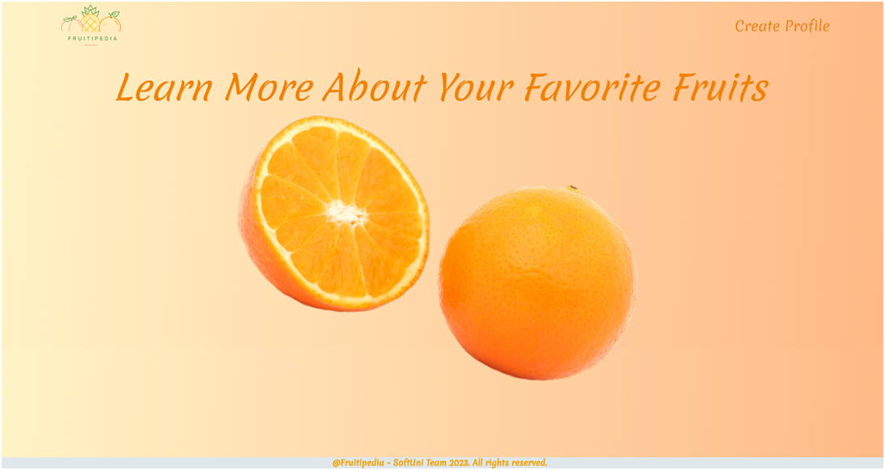

The "Dashboard", "Add Fruit", and "Profile" links on the navigation bar are only visible when the user has a profile:

Create Profile Page - 10p
Template file: "create-profile.html"
The page consists of:
•	A navigation bar with:
•	"Fruitipedia" link, which leads to the index page.
•	"Create Profile" link, which leads to create profile page.
•	A profile creation form consisting of:
•	A "First Name" field, a placeholder "First Name" and no label
•	A "Last Name" field, a placeholder "Last Name" and no label
•	An "Email" field, a placeholder "Email" and no label
•	A "Password" field, a placeholder "Password" and no label (When the user enters his/her password, the symbols could be hidden or visible)
•	A button "Create"
•	When you click on it if the profile is successfully created, you should be redirected to the dashboard page.
•	Otherwise, the form should show the appropriate validation errors in the form.

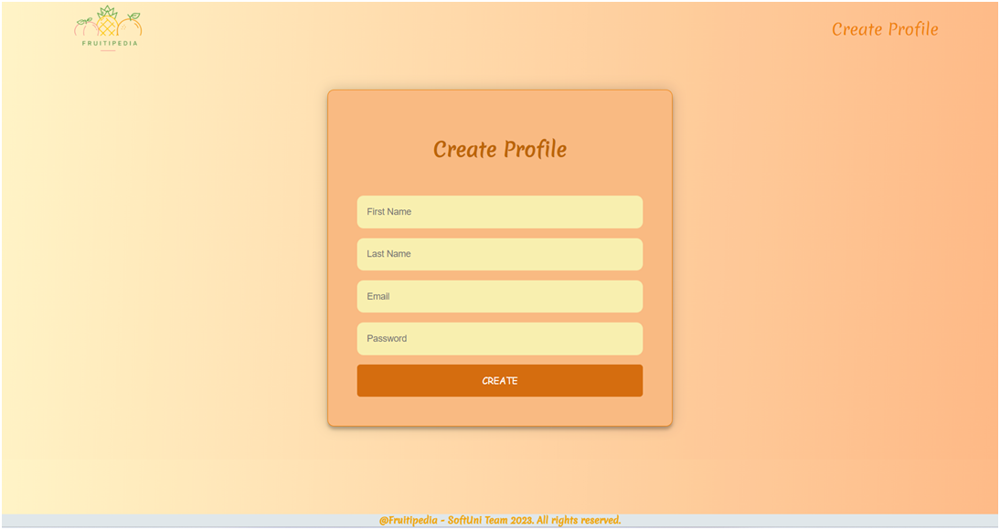

Dashboard Page - 10p
Template file: "dashboard.html"
The dashboard page shows all fruits which have been created by the user. 
If there are no fruits created yet, the page should have the following:
•	A navigation bar, as shown below.
•	A heading "No fruit info yet"

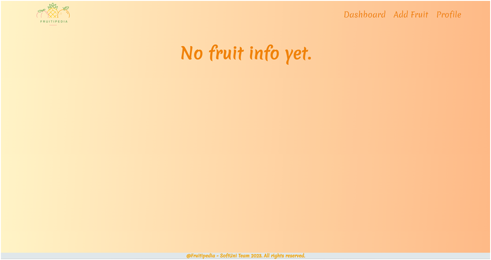

If the user has some fruits, the page should have the following:
•	A navigation bar, as shown below.
•	A division for each fruit, showing:
•	The fruit's image
•	The fruit's name
•	The fruit's description. The description should show only the first 50 characters!
•	A button "More Info" leading to the details page for the selected fruit

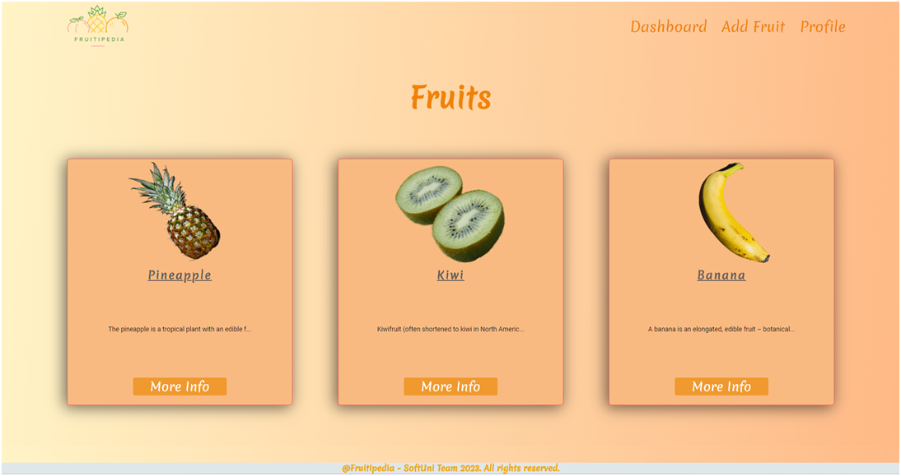

Create Fruit Page - 10p
Template file: "create-fruit.html"
The page consists of:
•	A navigation bar, as shown below.
•	A fruit creation form consisting of:
•	A "Name" field, a placeholder "Fruit Name" and no label
•	An "Image URL" field, a placeholder "Fruit Image URL" and no label
•	A "Description" field, a placeholder "Fruit Description" and no label
•	A "Nutrition" field, a placeholder "Nutrition Info" and no label
•	A button "Add Fruit"
•	When you click on it if the fruit is successfully created, you should be redirected to the dashboard page.
•	Otherwise, the form should show the appropriate validation errors.

Fruit Details Page - 10p
Template file: "details-fruit.html" 
This page contains a fruit’s information. It should have the following:
•	The fruit's image
•	The fruit's name
•	The fruit's description
•	The fruit's nutrition info, starting with a paragraph "Nutrition" (visible even if there is no nutrition info)
•	An "Edit" button that leads to the edit fruit page
•	A "Delete" button that leads to the delete fruit page

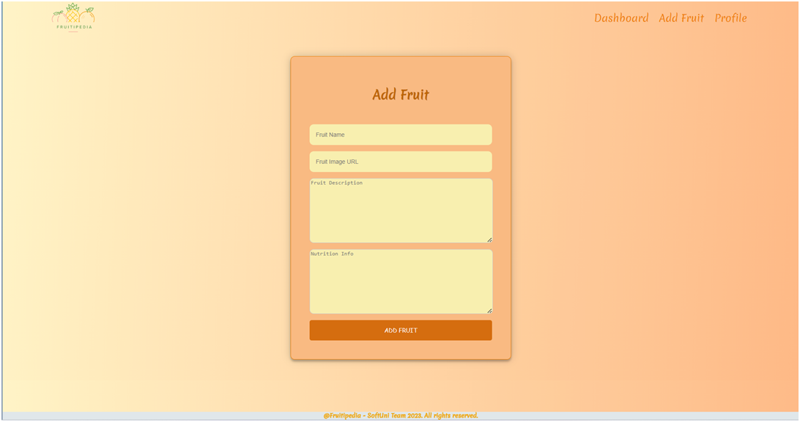

Fruit Details Page - 10p
Template file: "details-fruit.html" 
This page contains a fruit’s information. It should have the following:
•	The fruit's image
•	The fruit's name
•	The fruit's description
•	The fruit's nutrition info, starting with a paragraph "Nutrition" (visible even if there is no nutrition info)
•	An "Edit" button that leads to the edit fruit page
•	A "Delete" button that leads to the delete fruit page

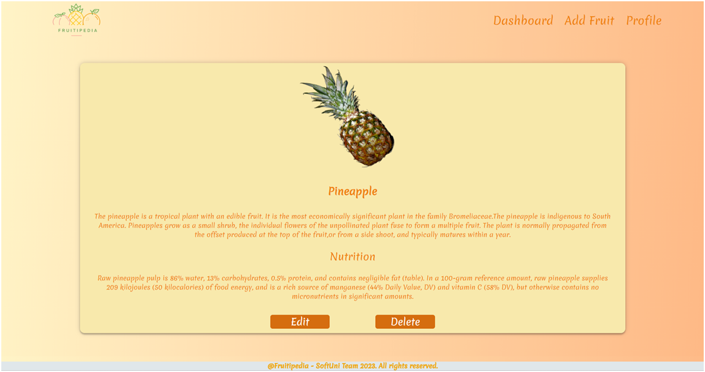

Edit Fruit Page - 10p
Template file: "edit-fruit.html"
On the page, the form must be filled with information about the fruit we want to edit. Each field has a label: "Name:", "Image URL:", "Description:", and "Nutrition:".
When you click on the "Edit" button:
•	If the fruit is successfully edited, you should be redirected to the dashboard page.
•	Otherwise, the form should show the appropriate validation errors.

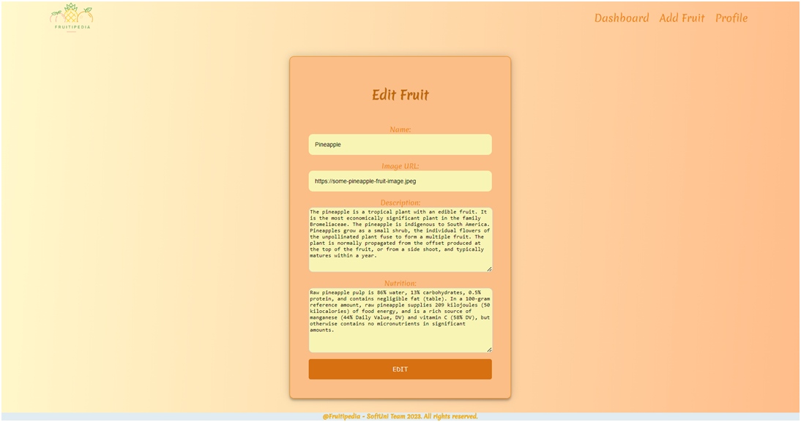

Delete Fruit Page - 10p
Template file: "delete-fruit.html"
On the page, the form must be filled with the fruit's information, and all the fields should be disabled. Each field has a label: "Name:", "Image URL:" and "Description:".
When you click on the "Delete" button, the fruit is deleted from the database, and you should be redirected to the dashboard page.
The deleted fruit should be no longer visible in the app.

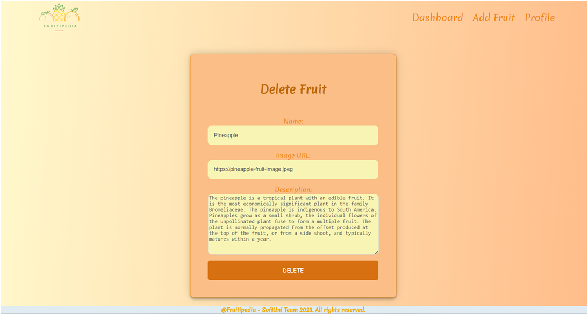

Profile Details Page - 10p
Template file: "details-profile.html"
This page contains the user's information. It should have the following:
•	A profile picture. If no picture is given, the page should show a default profile picture (in the static/image folder)
•	First name and last name:
•	The email
•	The age
•	The total number of posts that the user has. Display 0(zero) if there are no posts.
•	An "Edit" button that leads to the edit profile page
•	A "Delete" button that leads to the delete profile page
If the user has a profile picture:

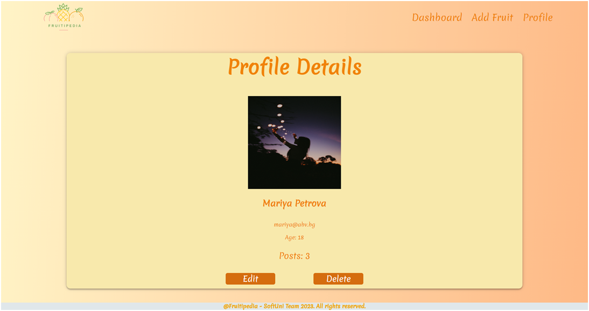

If the user doesn't have a profile picture: 

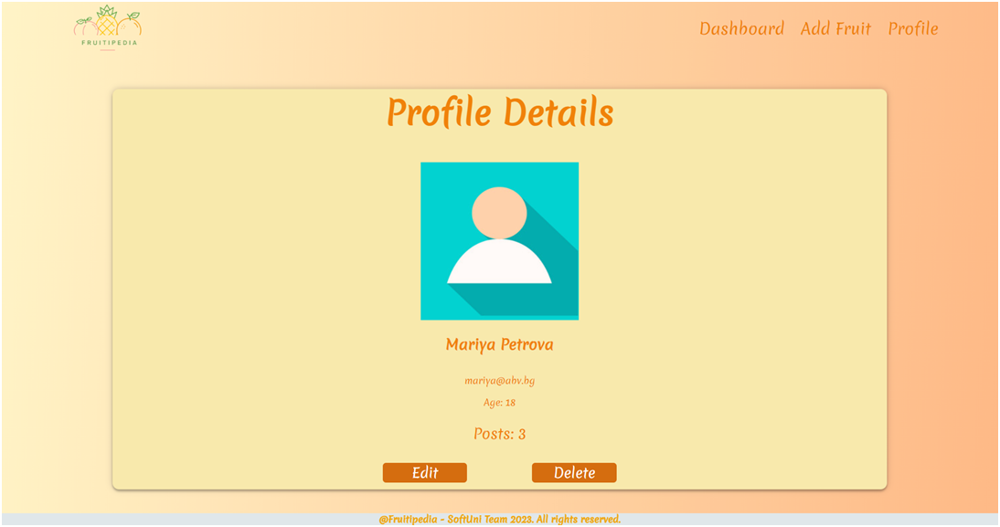

Edit Profile Page - 10p
Template file: "edit-profile.html"
On the page, the form must be filled with the information of the profile we want to edit. The profile edition form has additional fields as shown below:
•	A "First Name:" field
•	A "Last Name:" field
•	An "Image URL:" field
•	An "Age:" field
All fields have labels.
When you click on the "Edit" button:
•	If the profile is successfully edited, you should be redirected to the profile details page.
•	Otherwise, the form should show the appropriate validation errors.

Delete Profile Page - 10p
Template file: "delete-profile.html"
Deleting a profile should delete the profile info and all of his /her added fruits. After deletion, the user should be redirected to the index page.

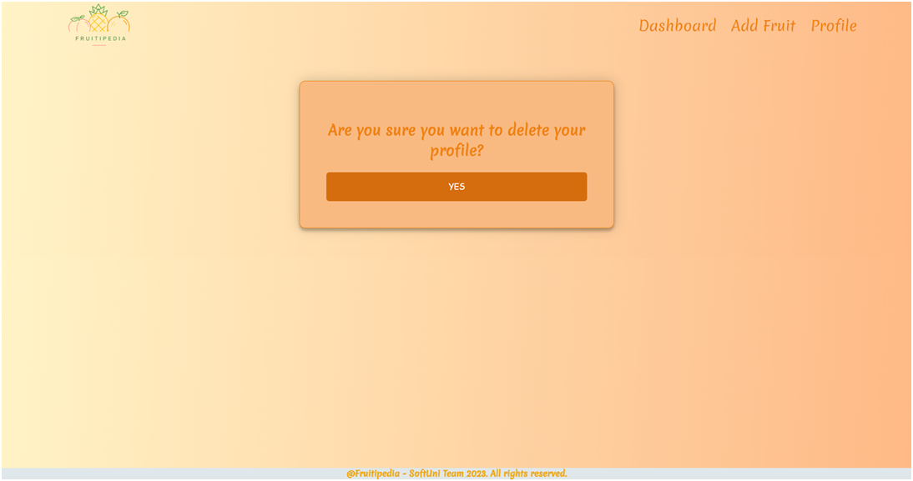

